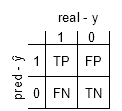
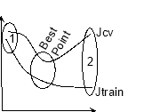
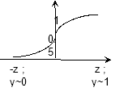
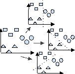
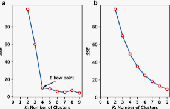
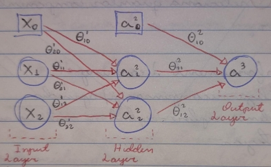



Artificial Intelligence

“is the simulation of human intelligence processes by machines”

[**1. The statistical learning	4**](#_dosidvxded0c)**

[Estimate f	4](#_zbez9wf577n5)

[Prediction vs Inference	4](#_420710osf2hc)

[Model Evaluation	4](#_zaubybuk135)

[Supervised - Classification	4](#_gs72rnt1dtxy)

[Supervised - Regression	5](#_gdntb5e52lke)

[Not Supervised	5](#_sobgd4snppjx)

[Model Selection	7](#_32nnulgavvwz)

[Probabilistic Measures	7](#_dwutqtdqjjpk)

[Resampling Methods	7](#_im1mvy2u5d17)

[Hyperparameter Tuning	8](#_mc54uhc2pfde)

[GridSearchCV](#_58cady9u5y6x)[	8](#_58cady9u5y6x)

[RandomizedSearchCV	8](#_cj37613aeait)

[**Fields	9**](#_we0h6vpvbhec)

[2. NLP	9](#_r5petbj5emg)

[3. Neural Networks	11](#_ru1cflj66jq6)

[4. Evolutionary Computation	11](#_zqxx1guh7i6)

[5. Vision	11](#_tscno8ah7cyp)

[6. Robotics	11](#_o2uxq8q3psco)

[7. Speech Processing	11](#_wktx9g5ygsvi)

[**8. Bias ](#_4792d1upc2pk)[vs Variance](#_4792d1upc2pk)[	12**](#_4792d1upc2pk)

[**9. Optimization	13**](#_uzemmcutk7xp)

[a. Constrained and Unconstrained Opt	13](#_4p5i9ae3ncxx)

[b. Stochastic Gradient Descent - SGD	13](#_glx1c99dufhw)

[c. SGD w/ Momentum	13](#_wpfb227hyw6i)

[d. Normal Equation	13](#_u6zbbogdvnif)

[e. Regularization	14](#_kle2nfhovvrz)

[f. Ada Grad	14](#_fl6mbhf4qs6o)

[g. RMS Prop  ---  Adam	14](#_eld45e2krimj)

[h. Lagrange Multipliers	14](#_1ql67qadmw4e)

[i. …	14](#_v968u3s5qw4p)

[**Algorithm	15**](#_6ur2c4i82tjx)

[10. Linear Regression	15](#_ohmlsmyogfqz)

[Ridge, Lasso ](#_e76sgjz6530h)[n Elastic](#_e76sgjz6530h)[ Net	16](#_e76sgjz6530h)

[Mathematically	17](#_lg8weil1ejp9)

[11. LOESS Regression	18](#_oyvvt26w2hdj)

[12. Classification	19](#_8a52uf4ztup8)

[Discriminant Analysis	19](#_29zgmu3jfp7s)

[Naive Bayes	19](#_2x1j86m7bqtv)

[Logistic Reg	19](#_ej8ylsxfrgs)

[Maximum Likelihood Estimate	19](#_vay06ysbgdxg)

[Mathematically - Log Reg	20](#_mwwigj6n8nij)

[Mathematically - Naive Bayes	21](#_47qofas3z402)

[13. Decision Trees	22](#_t89bxlifxxvq)

[Mathematically - CART	22](#_f4pqgimd6oxg)

[14. SVM	23](#_wxwpljippl7c)

[Kernel	23](#_du4m1lhwm6os)

[Mathematically	24](#_7mku3y4ajqf)

[15. K Nearest Neighbours	25](#_9ao876o4j07c)

[16. K-Means	26](#_4zg4qn6owt3x)

[17. DBSCAN	27](#_k6dejafi0cam)

[18. K-Medoids	28](#_bzbdmhyde1sh)

[19. Reinforcement Learning	29](#_h5ubsd4umlc2)

[20. Feature Selection / Dimensionality Reduction	30](#_w0mev04znhsk)

[Missing Values ​​Ratio	30](#_jj0lxmxl9ud6)

[Low Variance Filter	30](#_q8py74koge42)

[High Correlation Filter	30](#_avctr8skctrc)

[Random Forest	30](#_w7mffbtpe6se)

[Backward Feature Elimination	30](#_ifp9hx5fl52f)

[Forward Feature Selection	30](#_sji6t14w0kdp)

[Factor Analysis	30](#_w0xq7fy44xyb)

[21. Assoc. Rules / Market Basket	31](#_pdrz2z6lbsh)

[Metrics	31](#_6froc7c2ivpz)

[Apriori and FPGrowth Algorithm	31](#_zeytzwqnm2tk)

[22. Neural Network	32](#_vs9b8b35jcvu)

[Feed-Forward NN	32](#_u3hlerwgdm11)

[Cost Function	32](#_lc5vwiacndoe)

[Forward Propagation	32](#_h68kj9qeuzbj)

[Back Propagation	33](#_fqt1cj5hlauq)

[Gradient Checking - perform for all θ’s.	33](#_wscac9vgp8c0)

[Convolutional NN	33](#_bwg9hb0x3y9)

[Recurrent NN	33](#_mvjswi4zvoae)

[Autoencoders	33](#_a2rhrdsykr9r)

[Generative models	33](#_i3mtkad7tu1z)

[Tensorboard	33](#_66niml6qet4x)

[**Cases	34**](#_amxcmtmpvpe)

[23. Recommended System	34](#_hexvevl30zob)

[24. …	34](#_nhb9w0ibr51n)

1. # **The statistical learning**
   Refers to a vast set of tools for understanding data.

   The objective is to apply a statistical method of learning to the training data to estimate the unknown function f (or h), such that: Y=f(X), for each (X, Y).

   Can be **supervised**, there are input and output data or **unsupervised**, there are inputs but no outputs.

## Estimate f
When the model’s flexibility is high - *bigger variance, if data change, so f*, its interpretability will be low.

When the model’s flexibility is low, its interpretability will be high.

Parametric Methods

Model-based in two steps:

(1) makes an assumption about the functional form of  f

(2) we need a procedure that uses the training data to fit or train the model

The model may not match the true unknown form of  f.

Non-parametric methods

Make no explicit assumptions about the functional form of  f.

Seek an estimate of f that comes as close as possible to the data points without being too coarse or distorted.

A large number of observations are required.

## Prediction vs Inference
**Pred:** seek to predict Y based on X ---> Y=f(X).

**Inf:** seek to understand the relationship between X and Y, or more specifically, to understand how Y changes as a function of X1, ..., Xn.

*Linear models* allow inferences from relatively simple and interlinear models, but may not produce good predictions. Already *highly nonlinear* approaches can provide very accurate predictions for Y, but generate a less interpretable model - bad inference.

## Model Evaluation
### Supervised - Classification

**ROC** shows how well a model distinguishes between classes, it is a curve between *‘True Positive Rate’ (axis y)* and *‘False Positive Rate’ (axis x)*.

*True Positive Rate=TPTP+FN*		*False Positive Rate=FPFP+TN*

**AUC** is the area under the ROC curve, ranging from 0 to 1 *- bigger is better*, the model has a chance of *AUC%* distinguish correctly; if *AUC* is 0.5, the model has no capacity to distinguish the classes; if *AUC* is 0, the model is inverting classes.

**Confusion** **Matrix** - returns an array with *False* *Positive*, *False* *Negative*, *True* *Positive*, *True* *Negative*; respectively *FP*, *FN*, *TP* and *TN.*

↑TP Rate / Recall / Sensitivity=TPTP+FN	↓TN Rate / Specificity=TNFP+TN *- inversely proportional*

FP Rate=FPTN+FP =1-Specificity		Precision=TPTP+FP

Accuracy=TP+TNtotal examples 			Error Rate=1-Accuracy

Matthews Corr=TP\*TN - FP\*FNTP+FP\*TP+FN\*TN+FP\*TN+FN *- measure how good the classifier is;  [-1, +1], where +1 is perfect and 0 is no better than random.*
### Supervised - Regression
Median Absolute Error  -  *medaey,y=mediany1-y1, ..., yn-yn*
\*
`     `robust against outliers - gives a typical error

Mean Squared Logarithmic Error  -  msle=1ni=0n-1log(1+yi)-log(1+*yi)*2

`    `less sensitive to large values because o the log - focus on relative accuracy

<,,,

Mean Absolute Error  -  mae=1ni=0n-1 *yi-yi*  

`     `it’s easy to interpret as it’s on the same scale as the target value - + lower better model

Mean Squared Error  -  mse=1ni=0n-1*yi-yi*2

`     `it penalizes larger errors more than smaller ones (sensitive to outliers) - + lower better model

Root MSE  -  rmse=mse				Root MSLE - rmsle=msle

R-Squared  -  r²=1-i=0n-1*yi-yi*2i=0n-1*yi-y*2 

`      `summarize how well a model fits a set of data (its explanatory power) - + high better model 

Adjusted R-Squared  -  r²=1-(1-r²)(n-1)n-p-1, where p is the numb of predictors 

`      `adjust r² to the number of predictors - good when  models has diff numb of predictors 

### Not Supervised
If it is a probabilistic method, use some measure of probability *- like log probability, perplexity -* in the data. High probability, good job.

To measure the quality of cluster results: 

*n is the number of data points 		m is the number of cluster* 

*nj is the the numb of objs in cluster j 		ni is the numb of objs in class i*

**External Indexes**, we evaluate the results of a clustering algorithm based on a known cluster structure from a dataset (or cluster labels).

F-measure		F(i,j)=2\*Recall(i,i)\*Precision(i,j)Precision(i,j)+Recall(i,j)

Recall(i,j)= nijni  *-*  Precision(i,j)= nijnj

The F-Measure values are within the interval [0,1] and larger values indicate higher clustering quality.

NMIMeasure		NMIM(X,Y)=I(X,Y)H(X)H(Y) , where I is mutual information

between two random var and H denotes the entropy,

X is consensus cluster  and  Y is true labels

Is called Normalized Mutual Information

Entropy		E=j=1mnjnEj , where Ej is the class dist of the objs

Ej=i pij log(pij)

Entropy measures the purity of the cluster's class labels. Thus, if all clusters consist of objects with only a single class label, the entropy is 0. However, as the class labels of objects in a cluster become more varied, the entropy increases. The total entropy for a set of clusters is calculated as the weighted sum of the entropies of all clusters.

Purity			Purity=j=1mnjn Pj , where Pj is the cluster purity

Pj=1njMaxi(nji) is the numb of objs in j with class label i	

In other words, 𝑃𝑗 is a fraction of the overall cluster size that the largest class of objects assigned to that cluster represents. The overall purity of the clustering solution is obtained as a weighted sum of the individual cluster purities. Similar to Entropy.

**Internal Indexes**, we evaluate results using quantities and resources inherent in the dataset, not external data.

Bic Index 	BIC=-ln(L)+vln(n) ,where 𝑛 is the number of objects

and 𝐿 is the likelihood of the parameters to generate the data in the model

and 𝑣 is the number of free parameters in the Gaussian model

The BIC index takes into account both fit of the model to the data and the complexity of the model. A model that has a smaller BIC is better. Is devised to avoid overfitting.

Calinski-Harabasz  	CH=trace(SB)trace(Sw)\*np-1np-k 

, where 𝑆B is the between cluster scatter matrix

and Sw the internal scatter matrix

and np the number of clustered samples

and 𝑘 the number of clusters 

Davies-Bouldin 	DB=1ci=1cMaxi≠jd(Xi)+d(Xj)d(ci,cj)

, where 𝑐 denotes the number of clusters

and 𝑖, 𝑗 are cluster labels

and 𝑑(𝑋𝑖) and 𝑑(𝑋𝑗) are all samples in clusters 𝑖

and 𝑗 to their respective cluster centroids

and  𝑑(𝑐𝑖, 𝑐𝑗) is the distance between these centroid

This index aims to identify sets of clusters that are compact and well separated. Smaller value of 𝐷𝐵 indicates a “better” clustering solution

Silhouette Index	s(i)=bi-a(i)Max{ a(i),  b(i) } 

, where  𝑎(𝑖) is the average distance between the 𝑖𝑡ℎ sample

and all of samples included in 𝑋𝑗

AND   𝑏(𝑖) is the minimum average distance between the 𝑖𝑡 𝑠ℎ

and all of the samples clustered in 𝑋𝑘(𝑘 = 1, . . 𝑐; 𝑘 ≠ 𝑗)

For a given cluster, 𝑋𝑗(𝑗 = 1, . . 𝑐), the silhouette technique assigns to the 𝑖𝑡ℎ sample of 𝑋𝑗 a quality measure, 𝑠(𝑖) = (𝑖 = 1, … 𝑚), known as the silhouette width.

This value is a confidence indicator on the membership of the 𝑖𝑡ℎ sample in the cluster 𝑋𝑗.

Tracks how every point in one cluster is close to every point in the other clusters in the range of -1 to +1.

High values indicate that the points from two clusters are far away, 0 indicates that the points are close to the decision boundary and values close to -1 suggest that the points have been incorrectly assigned.

Dunn Index		Dunn=min1siscmind(ci,cj)max1skscdXk

, where d(ci,cj) defines the intercluster distance between cluster 𝑋i and 𝑋j

and d(Xk) represents the intracluster distance of cluster Xk

and c is the number of cluster of dataset

Large values of index Dunn correspond to good clustering solutions.

Focuses on identifying clusters that have low variance and are compact.

With higher number of clusters and more dimensions, the computations cost increases.

## Model Selection

### Probabilistic Measures
Choose a model via in-sample error and complexity.

Don’t take into account the model performance but also the model complexity, which is the measure of the model’s ability to capture the variance in the data.

Are appropriate when using simpler linear models like linear regression or logistic reg where the calculating of model complexity penalty is known and tractable.

Akaike Information Criterion - AIC

is the measure of information loss

the model with the least information loss is suggested as the model of choice

AIC=(2k-2log(L))/N, where k is numb of indep var

L is maximum likelihood of the model

N is numb of data points in the training set

Bayesian Information Criterion - BIC

derived from the Bayesian probability concept

is suited for models that are trained under the maximum likelihood estimation

BIC=k\*log(N)-2log(L), where  k is numb of indep var

L is maximum likelihood of the model

N is numb of data points in the training set

Minimum Description Length - MDL

derived from the Information theory which deals with quantities such as entropy, that measure the average number of bits required to represent an event from a probability distribution or a random variable

is the minimum number of such bits required to represent the model

MDL=L(h)+L(D|h), where d is model   and   D is the predictions

L(h) is numb of bits required to represent the model

L(D|h) is numb of bits required to represent the pred from mdl

Structural Risk Minimization - SRM

### Resampling Methods
Choose a model via estimated out-of-sample error.

This is achieved by splitting the training dataset into sub train and test sets, fitting a model on the sub train set, and evaluating it on the test set.

This process may then be repeated multiple times and the mean performance across each trial is reported.

Random train/test splits

are used to randomly sample a percentage of data into training, testing sets

original population is well represented in all sets *- prevent a biased sampling*

can create two test sets, one for feature selection/tuning and the other for validation

Cross-Validation

randomly shuffling the dataset and then splitting it into k groups

on iterating over each group, the group needs to be considered as a test set while all other groups are clubbed together into the training set

model is tested on the test group and the process continues for k groups

in the end of the process, one has k different results on k different test groups, the best one is one with the highest score

Bootstrap

it is a resampling technique that creates the bootstrap sample by sampling data points from the original dataset with replacement

the sample can contain multiple instances of the same data point

## Hyperparameter Tuning
*tune hyperparameters for Machine learning models*
### GridSearchCV
Searches for the best set of hyperparameters from a grid of hyperparameters values *- it will test for all possible combinations*.

It’s very computationally expensive, because it builds a model for all the possible combinations.
### RandomizedSearchCV
Goes through only a fixed number of hyperparameter settings, by moving within the grid in a random fashion to find the best set.

Reduces unnecessary computation, by building a model for a few combinations.

# **Fields**

1. ## NLP
   *Natural Language Programming*

Refers to the branch of computer science concerned with giving computers the ability to understand text and spoken words in much the same way human beings can.

Combines computational linguistics *- rule-based modeling of human language -* with statistical, machine learning, and deep learning models.

Together, these technologies enable computers to process human language in the form of text or voice data and to *understand* its full meaning, complete with the speaker or writer’s intent and sentiment.

Data Clean

Has the goal to produce clean text, that is, human language rearranged into a format that machine models can understand.

Eliminates *stopwords*, removes *unicode* *words (punctuation, emoji, URL, @)*, normalizing text *(removes capitalization)*, simplifies complex words to their *root* *form*.

**Tokenize**

break up text into small pieces, normally words and punctuation *- commas, full stops, exclamation marks, question marks, ellipses, . . .*

normally separated them by blank space

the pieces can also be character and sub-word level

**Stop words**

some words might not add any information and can be safely removed from the data

the word can be prepositions, conjunctions, articles

**Stemming**

group by the word root form, i.e. cutting off their endings

meaning might not be lost and analytical accuracy might be improved

ex: all of jump, jumped, jumps, jumping would become jump

**Lemmatize** *- sophisticated version of stemming*

group by the word definition form, it takes into account irregularity and context

separate present, past and continious

ex: jump and jumps is jump, jumped is jumped and jumping is jumping

Techniques

**TF-IDF**

statistical measure that tells how important a word is to a document in a collection of documents						*TF-IDF = TD \* IDF*

is calculated by multiplying 2 values - *term frequency* and *inverse document frequency*

has the goal to find words that have a high frequency in that document but not anywhere else in the corpus, that is, in all documents

TF is used to calculate how frequently a word appears in a document: 

TF(w, d)=count of w in dnumb of word in d

Document Frequency *DF* measure the occurrence of a word in the corpus 

DF(w)=count of w in all d

IDF is just the opposite of DF, measure the usefulness of a term in the corpus

IDF(w)=total of dcount of w in all d

**Part of Speech  *POS*  Tag**

identify words as nouns *N*, verbs *V*, adjectives *ADJ*, adverb *ADV*, preposition *P*, conjunction *CON*, pronoun *PRO*, interjection *INT*

**Keyword Extraction** 

has the goal to find important keywords in a document

obtaining meaningful insights for a topic in a short span of time

has two ways: (1) through TF-IDF or (2) use some lib, like Gensim

**Word Embeddings** 

also known as vectors are the numerical representations for words in a language

these representations are learned such that words with similar meaning would have vectors very close to each other

individual words are represented as real-valued vectors or coordinates in a predefined vector space of n-dimensions

ex: words queen and king has similar vector (‘re opposite) --- king and walked has more different vectors --- walking and walked has similar vectors (‘re from same root)

also useful in understanding relationship between words

*curiosity: in the vector space, the distance between king and queen would approximately be equal to the distance between man and woman*

**‘N’-grams**

group together multiple words into phrases such as "red flag,” "jump the shark," etc

N is the number of words in the phrase

**Multiple meanings**

sometimes one needs to look at surrounding words to get the correct meaning

"The will of the people" or “I will have pizza for lunch" or "In his will he left all his money to his cat.”

some words might be spelled the same, and have the same root, but be subtly different, for example, read and read

**Sentiment Analysis**

the dissection of data (text, voice) in order to determine whether it is; can be Positive, Negative, Happy, Angry and so on

make it possible to transform feedback, reviews or social media reaction into numbers

**Text Summarization**

used to concisely and briefly summarize a text in a fluent and coherent manner

is the breakdown of jargon, whether scientific, medical, technical or other, into its most basic terms using natural language processing in order to make it more understandable

**Topic Modeling**

is an unsupervised NLP technique that utilizes artificial intelligence programs to tag and group text clusters that share common topics

**Named Entity Recognition  *NER***

tags’ named identities’ within text, whether they’re organization names, peoples, locations, etc

1. ## Neural Networks
Teaches computers to process data in a way that is inspired by the human brain.

Uses interconnected nodes in a layered structure that resembles the human brain.

Creates an adaptive system that computers use to learn from their mistakes and improve continuously.

Each node, or artificial neuron, connects to another and has an associated weight and threshold. If the output of any individual node is above the specified threshold value, that node is activated, sending data to the next layer of the network. Otherwise, no data is passed along to the next layer of the network.

Attempt to solve complicated problems, like summarizing documents or recognizing faces, with greater accuracy.

1. ## Evolutionary Computation
*Genetic Algorithms - Genetic Programming - Ant Colony Opt*

Is a family of algorithms for global optimization inspired by biological evolution.

An initial set of candidate solutions is generated and iteratively updated. Each new generation is produced by stochastically removing less desired solutions, and introducing small random changes.

In biological terminology, a population of solutions is subjected to natural selection (or artificial selection) and mutation. As a result, the population will gradually evolve to increase in fitness, in this case the chosen fitness function of the algorithm.

Can produce highly optimized solutions in a wide range of problem settings.

Evolutionary algorithms only involve techniques implementing mechanisms inspired by biological evolution such as reproduction, mutation, recombination, natural selection and survival of the fittest.

1. ## Vision
   *Object Recognition - Image Understanding*

1. ## Robotics
   *Intelligent Control - Autonomous exploration*

1. ## Speech Processing
*Speech Recognition and Production - Siri*

Is the study of speech signals and the processing methods of signals.

The signals are usually processed in a digital representation, so speech processing can be regarded as a special case of digital signal processing, applied to speech signals. 

Aspects of speech processing include the acquisition, manipulation, storage, transfer and output of speech signals.

Different speech processing tasks include speech recognition, speech synthesis, speaker diarization, speech enhancement, speaker recognition, etc.

1. # **Bias vs Variance**
**Bias**  *tendency to keep learning the same thing wrong*

*difference between the average prediction of our model and the correct value*

*model with high bias:*

*pays little attention to the training data*

*oversimplifies the model*

*leads to high error on training and test/validation data*

**Variance**  *tendency to learn random things*

*is the variability of model pred for a data point / value which tells us spread of our data*

*model with high variance:* 

*pays a lot of attention to training data* 

*doesn’t generalize good on new data*

*perform very well on training data but has high error rates on test/validation data*

Err(x)=EY-f(x)²	*, where Y is the data and f the model*

*Err(x)=E*f(x)*-f(x)²+E*f(x)-Ef(x)*²+σe2	- Total Error*

*Err(x)=Bias2+Variance+Irreducible Error / Noise*

*(1)*   ↑Bias         |      Jtrain is high	|     big

`   `*Underfitting*    |     Jcv≃Jtrain	|       λ

\---------------------------------------------------------

*(2)*    ↑ Var        |     Jtrain is low        |    small

`    `*Overfitting*    |     Jcv>>Jtrain	|        λ

*are inversely proportional*

`    `*Fix High Bias*     *more complex J - add features - decrease* λ

*Fix High Variance  more examples - reduce features - increase* λ

`   `*Linear Models     often have High Bias and Low Variance*

*Nonlinear Models  often have Low Bias and High Variance*

1. # **Optimization**
   Main part of algorithms.

   Search for the best set of **parameters**, respecting its **constraints**, which will find the *minimum* of the **cost** **function**

   **Let:   J     →Cost Function**

   `          `**θ    →Old Parameters Vector**

   `          `**t     →New Parameters Vector**

   `          `**k    →Indicates the parameter in use-0≤k≤n**

   `       `**n/m →Number of columns and rows**

   `          `**α    →Learning Rate**
   1. ## SSR ?
   1. ## Constrained and Unconstrained Opt

1. ## Stochastic Gradient Descent - SGD
In each iteration, choose a random record to used it to calculate the gradients

J must be convex and differentiable *- random initialization of parameters*.

*Algorithm*  → repeat until converge 

tk=θk-α\*∂∂θkJ

θk=tk

*Learning Rate*

Controls the size of the update *- starts with big steps and goes down*.

Small steps take a lot of time - Big steps can miss the min.

*Disadvantages*

Doesn't work very well with very large n *(NN's)* *- too many directions to adjust*.

Can get stuck in the minimum place.

1. ## SGD w/ Momentum
Uses the EWA concept *- Exponentially Weighted Average*.

Uses the average of the previous gradients.

Converges faster and reduces flickering.

*Algorithm*

moment=γ\*moment+∂∂θkJ

tk=θk-α\*moment

θk=tk
1. ## Normal Equation
θ=(XTX)-1XTY
1. ## Regularization
Technique to reduce overfitting. It’s decreases the magnitude of the θ's, so certain parameters will have little importance.

*Algorithm*

minθ  J+λj=1nθj , where λ is the Regularization Parameter
1. ## Ada Grad
Stores the sum of squares of all your gradients.

Gradients with high *(low)* values generate the large *(small)* squared term, so in the long run the gradient accelerates slowly *(rapidly)* in that direction

Takes less time to converge.

Great for convex problems and bad for non-convex problems.

*Algorithm*

squared\_grad += (∂∂θkJ)²

tk=( θk-α\*∂∂θkJ )  /  ( squared\_grad+1e-8)

θk=tk
1. ## RMS Prop  ---  Adam

1. ## Lagrange Multipliers
There are additional constraints.

Be: minx f(x),   subject to   gi(x)≤0   for all   i=1, .., m  *--  Primal Problem*

A non-practical way of converting the constrained problem into an unconstrained problem is use an indicator function: J(x)=f(x)+i=1m1(gi(x)), but it is not very good to handle it.

Each Lagrange multipliers corresponding to each inequality constraint, so: ℒ(x,λ)=f(x)+i=1mλigi(x)=f(x)+λTg(x)*, where g(x) has all constraints gi(x) and* λ*has all multipliers*.

Lagrange Duality is the idea of converting an optimization problem in one set of variables x *- primal variables*, into another optimization problem in a different set of variables λ *- dual var*.

1. ## …
# **
# **Algorithm**
**Lazy Algorithm:** model is generalized only as new data points are added.

**Eager Algorithm:** model is trained before being used on new samples.

*Lazy* methods are useful when there is new data appearing all the time, in such a situation *eager* models would quickly become outdated.

Data** --- *feeds* --> Algorithm** --- *generated* --> h, which is the hypothesis, a function that relates inputs to outputs.

Cost/Loss Functions represent how far away a mathematical model is from the real data.

Certain ML Algorithms exhibit sensitivity to feature scaling, whereas others remain mostly unaffected by it. Some that are sensitive are: Gradient Descent Based Algorithms and Distance-Based Algorithms *rely on calculating distances between data points*.

Summary

m: numb of rows		y(i): ith element of target var

n: numb of columns	xm(i): ith element of feature var

θ: parameter		X, Y: x/y vector

J: cost function		k: numb of class in y

1. ## Linear Regression
Supervised Learning for regression problems.

It’s a parametric method that models a dependent variable in terms of a set of independent variables.

Capture coefficients that relate each independent variable to the dependent one, using some technique, such as Ordinary Least Squares.

Y=θ0+θ1X1+θ2X2+ ... + θnXn+ε

The greater the correlation between the variables, the greater the variance for the associated parameters. Perfect correlation prevents fitting linear models *- does not create an inverse matrix*.

**Unbiased coefficients** with **high variance** will change a lot between different (unstable) runs of the model, but will *converge* in probability to the right place. 

**Biased coefficients** with **low variance** will be quite stable across different runs, but will *not*** *converge* in probability where they should

**Heteroscedasticity** is when the variables Y and X present variances that are not equal for all distributions, that is, data more scattered around the line - Var(ϵ) is ctns.

**Homoscedasticity** is the opposite, the data are more homogeneous, less dispersed *- detected using White Test*.

There is no **multicollinearity**, that is, independent variables (X) do not have exact or approximately exact linear relationships *- correlation -* with others indep var or a combination of them. If this happens, make the X matrix  *indep var* a singular matrix, which cannot be reversible, but the inverse of X is needed to calculate the estimator - err occurs.

**VIF** *- Variance Inflation Factor*, is a measure of the amount of multicollinearity in regression analysis. It’l take a variable and regress it against every other variable in the model, resulting in a *R².* 	VIF=11-Ri2, where i is the variable to process

The value tells *(in decimal form)* what percentage the variance R² is inflated for each coefficient. *VIF of 1.9 tells you that the variance of a particular coefficient is 90% bigger than what you would expect if there was no multicollinearity*

VIF=1→var not correlated

VIF∈ ]1,5]→var moderately correlated

VIF>5→var highly correlated

The model estimates are distributed according to a Gaussian distribution, provided certain conditions:

1\. Residuals are homoscedasticity *- test with White Test* 

2\. Residuals are not correlated *- usually occurs with temporal data - test with Durbin-Watson Test*

3\. There is no perfect correlation between variables and their combinations - no perfect multicollinearity

4\. Exogeneity: regressors not correlated with the error term - they usually happen when we exclude a relevant variable that is correlated with one of the regressors

5\. The model is linear and correctly specified - it’s not tested, the modeler himself decides

6\. There must be no outliers

*1 or 2 rule is violated: the parameter distribution will no longer be Gaussian, but the estimates will still converge. It cannot make any inferences, but it can still use point estimates.*

*3 rule is violated: can not calculate estimates.*

*4, 5 and 6 rule is violated: they break the consistency of estimates (biased)*

### Ridge, Lasso n Elastic Net
With lower lambda/bias *- closer to 0*, the model will resemble a linear regression model.

Ridge Regression 

Use L2 *'Euclidean’* Regularization *- allows us to model highly correlated regressors*

Introduce a bias; add a penalty equivalent to the square of the magnitude of the coeff.

It shrinks the coefficients and it helps to reduce the model complexity and multi-collinearity. Does not result in the elimination of coefficients or sparse models.

Suitable for data with strong relationships between independent variables.

J'(θT)=J(θT)+λj=1nθj2

Lasso Regression 

Use L1 Regularization

Introduce a bias; add a penalty equal to the absolute value of the magnitude of the coeff.

Can result in sparse models with few coefficients *- less important can be eliminated*.

Suitable for models showing high levels of multicollinearity.

J'(θT)=J(θT)+λj=1nθj

Elastic Net 

Use L1 and L2 Regularization *- a mix of them*

How much of each is used is defined by *r*, where if *r = 0* is like a Ridge, if *r=1* is like a Lasso

J'(θT)=J(θT)+rλj=1nθj+1-r2λj=1nθj2
###
###
###
###
###
###
###
###

### Mathematically
h0(x)=θ0+θ1x1(i)+ ... +θnxn(i)=[θ0 θ1 ... θn]X  ⇒  h0(x)=θTX

Mean Square Error - MSE

It's a cost/loss function *- SGD/Adam will minimize J*.

J(θT)=12mi=1m(hθ(x(i))-y(i))2 - 12 is a convenience for the SGD, derivative will cancel it

Ordinary Least Square - OLS	 *for 2 var (x,y)*

`	  `*it’s a approximation method that minimizes the distance; for multiple predictors use Normal Equation in opt*

θ0=Y-θ1X    and     θ1=i=1m(X(i)-X)(Y(i)-Y)i=1m(X(i)-X)²

Partial Derivatives MSE  --  *used in SGD*

∂∂θj12mi=1m(hθ(x(i))-y(i))2=1mi=1m(hθ(x(i))-y(i))xj(i)

1. ## LOESS Regression
   *Locally Estimated Scatterplot Smoothing Reg.*

   It’s a non-parametric method and a weighted regression *- which allows us to capture long-term trends*.

   It works by doing many local regressions for each point and averaging the predictions.

   In particular, each model *(fitted around a point x0, y0)* is fitted using weighted least squares *(each point is weighted by how close the regressors are to the point x0)*.

   Has a parameter called **span**, which specifies the amount of data used in each of these regressions *- second-order polynomials are used in these regressions*.

   It combines much of the simplicity of least squares linear regression with the flexibility of nonlinear regression. 

   This is done by fitting simple models to localized subsets of the data to build a function that describes the deterministic part of the variance in the data, point by point. 

   In fact, one of the main attractions of this method is that the data analyst does not need to specify a global function to fit a model to the data, only to fit segments of the data.

1. ## Classification
   They are algorithms that divide the resource space into a collection of regions labeled according to the values that the target variable can take.

   The decision boundaries between these regions are linear: lines for 2D, planes for 3D, and hyperplanes with more features.

### Discriminant Analysis
Method used to find a linear combination of features that characterizes or separates two or more classes of objects. The resulting combination may be used as a linear classifier, or for dimensionality reduction before later classification.

The objective of discriminant analysis is to develop discriminant functions that are nothing but the linear combination of independent variables that will discriminate between the categories of the dependent variable in a perfect manner.

It allows identifying variables that best discriminate between groups.

Assuming that the conditional *probability density* functions p(x|y=0) and p(x|y=1) are both the *normal distribution* with mean and covariance parameters.

Under this assumption, the Bayes optimal solution is to predict points as being from the second class if the log of the likelihood ratios is bigger than the threshold.

Yc=α+θ1X1+θ2X2+...+θnXn *- c is the class of Y*

### Naive Bayes
Calculate the probability for each class *- it’ll compare between them, the bigger one is selected as class*.

Is called naive because the assumptions made are usually quite unrealistic *- ex: the words are independent of each other (‘AND Rule’), which is clearly not the case*.

It’s based on the Bayes Theorem *- is used to calculate each probability*. So the function denominator will not depend on the classes, so can be ignored. The numerator will decide, the bigger one is selected as class.

It can apply logarithm in the expression, it'll not change which class gives the maximum likelihood, just makes the number more manageable.

### Logistic Reg
It is used to determine the probability of an event *- captured in binary format: 0 or 1*

Normally use **logistic loss*** - *log loss*, the negative log-likelihood, ie, use a *natural logarithm* on h. The estimate is made using *maximum likelihood*.

The *dependent variable y,* in logistic regression, follows a *Bernoulli Dist.*

It is a method to analyze categorical response variables, it competes with the *Discriminant Analysis*, but the regression is more versatile, as it does not assume that the independent variables are normally distributed, as the *discrit. analysis* does.

Can be **Binary** *- response has only two possible categories*, **Multinomial** *- response has 3+ possible categories* or **Ordinal** *- response with 3+ categories with sorting*.

A *threshold value* is defined in the return of the prediction, above it returns 1, below it 0. Use a **Decision Boundary** to separate the predictions between classes. 

A prediction of 0.25 means that the *pred* has an uncertainty level of 25% which is 0 and 75% which is 1. Can use the l1 and l2 regularization.

### Maximum Likelihood Estimate
Is a method of maximizing "probability".

Defines the coefficients most likely to produce the observed data - this is achieved by maximizing the likelihood function *- gives the prob. of each possible choice*.

### Mathematically - Log Reg
if pred≥0.5⇒1  ;  if pred<0.5⇒0  and  0≤hθ(x)≤1

hθ(X)=sig(θTx)=11+e-θTX    ⇒  | hθ(x)=p(y=1 | x1θ)

`			        	       `⇒  | hθ(x)=1-p(y=0 | x1θ)

Sigmoid Function -  sig(z)=11+ez

| if z<0⇒y<0.5| ⇒  | if θTX≥0⇒y=1⇒hθ(x)≥0.5

| if z≥0⇒y≥0.5| ⇒  | if θTX<0⇒y=0⇒hθ(x)≥0.5

Cost Function *- log loss*

Let: Cost = -ylog(hθ(x))-(1-y)log(1-hθ(x))

J(θ)=1/m i=1mCost(hθ(x(i)),y(i)) *- overall negative log-likelihood*

if y=1⇒Cost(hθ(x),y)= -log(hθ(x))

if y=0⇒Cost(hθ(x),y)= -log(1-hθ(x))

Partial Derivatives of log loss  --  *used in SGD*

∂∂θj1mi=1mCost(hθ(x(i)),y(i))=1mi=1m(hθ(x(i))-y(i))xj(i)

One-vs-One

Multiclass Classification with binary model combination.

Let y∈{A, B, ..., k} then divides the problem into k(k-1)2 binary classifiers, using subsets of the training data: A*vs*B; B*vs*C; C*vs*A; …

The sample is then tested against each of these, giving a possible class for that data point *- the most common class is chosen*.

One-vs-All

Multiclass Classification with binary model combination.

Let y∈{1, 2, ..., k} then divides the problem into k binary problems.

hθ(0)(x)=p(y=0|x1θ)

hθ(1)(x)=p(y=1|x1θ)

`	   `…		…

hθ(k)(x)=p(y=k|x1θ)

pred=maxk (hθ(k)(x))

Softmax Function

Multiclass Classification without combining k binary models.

It predicts only one class at a time - *it is multiclass, not multi output*, so it should only be used with mutually exclusive classes.

Let y∈{A, B, ..., k} and x a random instance/row of the dataset. 

So, for each instance, calculates the score for each class - sk(x)=(θ(k))T\*x

Then, estimate the probability of a instance belong to a class by applying the softmax function to all scores of that instance - pk=sig(s(x))k= exp(sk(x))j=1kexp(sj(x))

To predict, it use: y=argmaxk sig(s(x))k=argmaxk sk(x)=argmaxkθ(k)T\*x

The goal is to minimize the Cost Function - *cross entropy*: J(θ)=-1mi=1mk=1Kyk(i)logpk(i)

The gradient vector *derivative* of J for class k is: ∇θ(k)J(θ)=1mi=1mpk(i)-yk(i)x(i)

### Mathematically - Naive Bayes
*be X the data/vector to be trained and it’s length is M, where xm for 1≤m≤M*

*Ck represent a class k, where k∈I and ≥2*

hθ(X)=p(Ck|X)=p(Ck)p(X|Ck)p(X) *- do it for each class and them compare between them by row*

Denominator can be ignored, so:

hθ(X)=p(Ck)m=1Mp(xm|Ck) 

With logarithm:

hθ(X)=lnp(Ck)+m=1Mlnp(xm|Ck)

lnp(Ck) *is known as the prior probability, the one estimated before taking into account any further information - typically get its from population knowledge or from the training set.*

1. ## Decision Trees
Supervised learning* for classification and regression problems.

The method uses a hierarchy of divisions of the data points according to the fields values *- so in each level, a decision is made, to take a direction*.

With a training set of data that has been classified, it is possible to construct the best possible tree structure of questions and answers.

So that when you get a new item to classify it can be done quickly and accurately.

The tree doesn't have to be binary and the answers can be numerical.

Each **node** represents a feature *- can repeat but not in the same path*, which realizes some **edges** representing the possible features values *- number of unique values is the number of edges*. **Leaves** are the answers *- can have one only answer*.

To decide which *feature* come first, is calculate its **entropy** using the following formula: -Σ p\*log2(p), where *p* is the probability of any answer *- sum for all possible answers*. In a binary form, it'll sum the probability of be *(p)* and not be *(q)*.

The **node/root** feature is selected by calculating the *total node/root entropy* for the original data *formula above* and the entropy of each **feature**.

So, for each feature entropy, make: *root entropy - feature entropy*, the resulting output is the **information gain** *- the bigger one is chosen to be the node*.

For the next few **nodes**, the *total node entropy* is calculated based only on the data that passed through the other nodes *- so, less data than original*. The feature entropy follows the same logic as before.

To calculate the feature entropy, for each possible value in the feature, use this formula: pValue\*EntropyValue, which pValue is the probability of find any answer if its follows the path of this possible value *- use the same data as before* and EntropyValue is the entropy for only the data with that value assigned in the feature *- follows the path of this possible value*.

**Measure of Impurity** 

a pure node would have a coefficient equal to 0, so all its instances must belong to the same class; to calculates the coefficient for the i-th node use:

`        `**Gini Coefficient** Gi=1-k=1npi,k2   ---   **Entropy**  Ei=-k=1npi,klog( pi,k)

**Stopping Rules** has the goal of stopping the split when a certain number of records is hit, so a leaf is created. Avoids *Overfitting*. Another way is through **Pruning**.

### Mathematically - CART
Classification and Regression Tree *CART* is used by Scikit-Learn

The algorithm divided the dataset into two subsets using a single characteristic k and a threshold tk. To do this, it searches for the set k,tk that produces the purest subsets *- weighted by size*.

This division is continued in the new subsets and stops only when it reaches the maximum depth or cannot find a division that reduces the impurity.

Cost Function is: J(k,tk)=mleftmGleft+mrightmGright

, where Gleft/right is the impurity measure of the left/right subset

mleft/right is the numb of instance/row in the left/right subset

1. ## SVM
Supervised learning for regression and classification problems.

It’s view starts by designing a particular function that is to be optimized during training,

based on geometric intuitions.

Support vector machines attempt to pass a linearly separable hyperplane through a dataset to classify the data into two groups. 

It also works with *non-linearly separable data*, in which cases **Kernel Trick** is used.

This **hyperplane** is a linear separator for any dimension: it can be a line (2D), plane (3D) and hyperplane (4D+).

The best hyperplane is the one with the largest possible **margins**, which is the distance of the hyperplane to the closest examples in the dataset.

The **support vectors**, which are the closest points to the hyperplane *- control it*.

C of Regularization

Controls how much misclassification it will allow *-  important to minimize the error*. 

As with all supervised learning, there is bias-variance compensation.

When it’s **small**, the classifier allows small amounts of misclassification - has big margins. It will have low bias but may not generalize well and have high variance.

When it is **big**, the classifier allows large amounts of misclassification - has small margins. It would generalize better, but it can have a large amount of bias.

When it is **zero**, there can be no misclassification and we have the maximum margin classifier.

Gamma γ

Defines how far the influence of a single training example reaches.

So, **high** gamma will consider only points close to the plausible hyperplane and **low** gamma will consider points at greater distance.

Kernel Trick

Kernels transform the resource space of the data to then create a linear hyperplane to classify the data.

It transforms the data so that it is possible to separate them linearly.

They are: *polynomial*, *radial basis* and *linear* kernels.

### Kernel
**Linear kernel** is a linear model, ideal for data linearly separable. Good for text- classification problems.

fm=similarity(x,l(m))=Σx⋅l(m)

**Polynomial kernel** is similar to the linear kernel, but the limit is of some definite but arbitrary order.

fm=similarity(x,l(m))=x⋅l(m)+1d*, where d is the degree*

**Kernel Radial (RBF)** uses normal curves around the data points and sums them up so that the limit of decision can be defined by a type of condition of topology, such as curves where the sum is above a value of 0.5.

fm=similarity(x,l(m))=exp-γx-l(m)2 

*Obs:* if x≈l(m)⇒fm≈exp(-γ\*0²)≈1

if x far away from l(m)⇒fm≈exp(-γ\*∞²)≈0

**Sigmoid kernel** is similar to logistic regression, where a logistic function is used to define curves according to the logistic value where this is greater than some value (probability modeling), such as 0.5 for the normal case.

fm=similarity(x,l(m))=tanh(γxl(m)+C)

**Gaussian** is a commonly used kernel. It is used when there is no prior knowledge of a given dataset.

fm=similarity(x,l(m))=exp(-x-l(m)22σ2) 

*Obs:* if x≈l(m)⇒fm≈exp(-0²2σ²)≈1

if x far away from l(m)⇒fm≈exp(-∞²2σ²)≈0

### Mathematically
Cost Function - find the θ's, each kernel has its own

*Normal (?)*

J(θ)=1mi=1mmax1-y(n)θTx(n)+θ0, 0+λθ²

*Gaussian Kernel*

J(θ)=Ci=1m[y(i)cost(θTx(i))+(1-y(i))cost(θTx(i))]+12j=1nθj2

∴    y=1⇒θTx≥1     and    y=0⇒θTx<1     and    C=1λ

After finding the θ's, define the landmarks *- Kernel Reference Points* l(i).

Let: (x(1),y(1)) ; (x(2),y(2)) ; ... ; (x(m),y(m))

`       `l(1)=x(1) ; l(2)=x(2) ; ... ; l(m)=x(m)

Then, generated the Kernel Func f and the Fmx1 vector:

fm=similarity(x,l(m))  and    Fmx1=[1 f1 ... fm]T

*each Kernel provide a similarity func*

So, with F:

hθ(x)=θTF , where  hθ(x)≥0⇒y=1  and  hθ(x)<0⇒y=0

How is the margin calculated ?

C: ↑C: ↓bias ; ↑variance - small λ

↓C: ↑bias ; ↓variance - big λ

σ²: ↑σ²: f varies less  - ↑bias ; ↓variance

` `↓σ²: f varies more- ↓bias ; ↑variance

1. ## K Nearest Neighbours
   Supervised learning for regression and classification problems.

   Think of *coloured dots in space*, where the **dimension** is the **number of features** and the **colors** being the **target variable** *- can be numbers or classes*.

   We want to classify a new dot *- figure out its color, given where it is in space*.

   We **measure distances** *- can be any in docs Math/Vector/Distances -* between the new data point and the *K* nearest data points.

   **Predict** which class our new data point belongs by **majority voting** *- Classification*

   **Predict** which number to return by **average** or other method *- Regression*

   A **small K** gives   low bias    but   high variance.

   A **large K** gives   high bias   but   low variance.

   It is necessary to **scale** all features.

   **Warnings:** although the non-existent learning part of the algorithm is a little fast, the classification of new data points can be quite slow *- measuring the distance between the new point and all of the already-classified points*.

   **Read:** Lectures on the Nearest Neighbor Method *(Springer Series in the Data Sciences)* by Gerard Biau and Luc Devroye, 2015

1. ## K-Means
   Unsupervised Learning.

   Sets the number of clusters *- k*. Uses Euclidean distance *- default*.

   It is necessary to scale all features.

   Grouping together unlabelled data points according to *similarities* in their features.

   Aims at minimizing the intra-cluster distance *- total squared error*.

   Algorithm

Random initiation of k cluster centroids - {u1, u2, ..., uk∈Rn}

For each m, a c(m) is created, which will contain the index of the centroid closest to that data point *- Cluster Assigned Step (min J)*

Redefines the u's with the average of the points that were assigned.

*Repeat the above 2 steps t times.*

Optimization Objective *- min J*

The algorithm has converged when the assignments no longer change.

J(c(1),...,c(m),u1,...,uk)=1mi=1mx(i)-uc(i)²

, where uc(i)  is the x(i) cluster centroid

Scree Plot of k

test 1, ..., m values of k

Plots the relationship J to each k tested *- uses the Elbow Method to find the best k*.

*Elbow point = Best K*

1. ## DBSCAN
*Density-Based Spatial Clustering of Applications with Noise -* Unsupervised Learning.

The cluster can be any shape *- ideal for special cases*, tracks the high-density regions.

Density is a measure of the number of data points in a specified area, defined by a center point with a certain value of distance.

Doesn’t require to specify the number of clusters and is not sensitive to outliers.

**Core points** are points with at least **minPts** points (including itself) within distance of **eps**. The distance can be anyone. Each cluster contains at least one **core point**.

Points that aren’t core-points and cannot be reachable from any core points are **outliers**.

The data points that can be reachable from a core point, belong to the cluster of that core point.

Algorithm

For each data point, find the points in the neighborhood within *eps* distance, and define the *core points* as those with at least *minPts* neighbors.

Define groups of connected core points as clusters.

Assign each non-core point to a nearby cluster if it’s directly reachable from a neighboring core point, otherwise define it as an outlier.

OBS:

A large eps tends to include more points within a cluster and a too-small eps will result in no clustering at all.

A too-small minPts is not meaningful because it will regard every point as a core point. A relatively larger minPts can be better to deal with data with more noise.

1. ## K-Medoids
   Unsupervised Learning.

Complexity of O(n log n) - Partition Around Medoids *PAM* converts each step from a deterministic computational to a statistical estimation problem.

Minimizes dissimilarities between points in a cluster and points considered as centers of that cluster.

Sets the number of clusters *- k*. Uses any distance *- d(.)*.

The number of records is *n*. Collection of medoids is *M*.

Dissimilarity is the summation of the absolute difference between medoids and data points - D=Σ |k-x|.

Dissimilarity is find using: mMSum of the Cost of points assigned to m

Algorithm

Find a set of *k Medoids* from the data points

Calculate the cost / distance of all data points to each medoid k *- min J*

Then, assign the data points with lower cost to Medoids *- calculate Total Cost*

Finally, swap medoid and non-medoid pairs to try to reduce the loss function or the dissimilarity among all possible k(n-k) pairs - *do this is continued till a convergence criterion is met*

Optimization Objective *- min J*

The algorithm has converged when the assignments no longer change.

J(M)=i=1nminmϵMd(m,xi)

1. ## Reinforcement Learning
   Uses rewards to learn. It is about taking suitable action to maximize reward in a particular situation. The agent is supposed to find the best possible path to reach the reward through a sequence of decisions.

   Explore-Exploit Dilemma: continue or switch strategies

Markov Decision Process

Be an **Agent** inserted in a stochastic **Environment.**

**Environment** has certain **States**.

**Agent** performs some **Action**.

**Actions** transform the **Env.** and lead to a new **State**, generating or not **Rewards**.

**Actions** follow rules, called **Policy**.

The **Agent's** objective is to maximize the gain of **Rewards**.

**Value** **Function** is the amount of expected future **Reward** coming out of this **State**.

Rt=rt+γ(rt+1+γ(rt+2+ ... ))=rt+γRt+1

, where  Rt: Reward from state t - future

rt: reward in t

γ: discount factor

1. ## Feature Selection / Dimensionality Reduction
It is simply the process of reducing the size of the feature set.

The fewer features our training data has, the fewer assumptions our model will make and the simpler it will be *- less chance of overfitting*.

As the number of features increases, the model becomes more complex.

With fewer resources: more accurate model, less compute, less training time, less storage space, remove noise.

### Missing Values ​​Ratio
A threshold value is set, and if the percentage of missing values ​​in any variable is greater than this threshold, we eliminate the variable, thereby reducing dimensionality.

### Low Variance Filter
Calculates the variance of each variable. Then we eliminate the variables with low variance compared to the other variables *- variables with low variance will not affect the target variable*.

### High Correlation Filter
Calculates the correlation between two numeric variables, if they exceed a predetermined threshold value, one of the two will be excluded. Because high correlation means they have similar trends and are likely to carry similar information.

### Random Forest
Algorithm that allows calculating the importance of an attribute, which is used as a parameter to discard the variables.

Data is converted to numeric form.

### Backward Feature Elimination
Follow the steps below:

1\. Take all variables present in our dataset and train the model with them

2\. Calculate the model's performance

3\. Calculate the performance of the model after eliminating each variable (*n times*), that is, we discard one variable at a time and train the model on the remaining n-1 variables

4\. We identify the variable whose removal produced the smallest or no change in model performance and then eliminate that variable

5\. We repeat this process until no variables can be eliminated

### Forward Feature Selection
Follow the steps below:

1\. Start with a single feature/variable

2\. Train the model n number of times using each feature separately

3\. Variable with the best performance is selected as the starting variable

4\. Then, repeat this process and add one variable at a time

The variable that produces the greatest increase in performance is retained

5\. Repeat this process until no significant improvement is seen in the model

### Factor Analysis
Variables are grouped according to the correlation between them, that is, variables from the same group will have high correlation and variables from different groups will have low correlation *- PCA is an example*.

*Find more in Statistics.MultivariateAnalysis.FactorAnalysis*

1. ## Assoc. Rules / Market Basket
Is one of the main techniques used to discover associations between items in transactions.

Looks for combinations of items that occur together frequently in transactions. In other words, it allows us to identify the relationships between the analyzed items.

Association rules are widely used for analysis and aim to identify strong rules discovered in transaction data using measures of interest, based on the concept of strong *rules*.

### Metrics
**Support** indicates how often a set of items occurs in the database. If it's too small it means we don't have enough information to draw conclusions. - Support = freq (A, B) / nA.

**Confidence** indicates how often the rule proved to be valid. However, the confidence for a rule with a very frequent *consequent* will always be high, so considering only the confidence value can lead to inaccurate analyses. - Trust (A -> B) = Support (A, B) / Support (A).

**Lift** summarizes the strength of association between item sets. Represents the increase in sales of the *consequent* given the *antecedent*. - Lift = Support(A, B) / [Support (A) \* Support (B)].

Lift = 1, means there is no correlation in the set.

Lift > 1, means that there is a positive correlation in the set.

Lift < 1, means that there is a negative correlation in the set.

### Apriori and FPGrowth Algorithm
**Rule:** consists of a *background* and a *consequent*, and both consist of sets of items. *- Ex: {Bread, Butter} -> {Milk}*

The extraction of association rules consists of two steps:

1\. *Generation of frequent sets:* only the sets of significant items are searched, generally they are sets that reach a minimum support *- it may take a while depending on the size of the base*.

2\. *Generation of rules for the sets:* for each set of the previous step, rules are identified that are above a minimum confidence limit.

Apriori

Two fundamental steps:

1\. *Join:* generation of sets with k-items.

2\. *Pruning:* sets that do not reach the minimum support are not considered frequent sets, and do not pass to the next iteration.

FPGrowth

The algorithm uses the tree structure to represent the database and this representation is called a frequent-pattern tree or FP tree.

1. ## Neural Network
Supervised Learning.

Is a series of algorithms that endeavors to recognize underlying relationships in a set of data through a process that mimics the way the human brain operates. 

In this sense, neural networks refer to systems of neurons, either organic or artificial in nature.

### **Feed-Forward NN**

θbca: weight

*a: layer numb* 

*b: row numb*

*c: unit numb*

ayx: neuron 

*x: layer numb*

*y: row numb*   

x0,a02: bias

` `|...----z12----...|	f: Activation Function

`      `a12=fθ101x0+θ111x1+θ121x2		  θ101 θ201	        a02

`      `a12=fθ201x0+θ211x1+θ221x2	    θ1=θ111 θ211	a2=a12

hθ(x)=a3=fθ102a02+θ112a12+θ122a22	  θ121 θ221	        a22

#### Cost Function
L: numb of layers	              -	Sl: numb of units of layer l

K: numb of output units	  -	(hθ(x))i: ith output

J(θ)=-1mi=1mk=1Kyk(i)loghθ(x(i))k+1-yk(i)log1-hθ(x(i))k+λ2ml=1L-1i=1Slj=1Sl+1θji(l)2

#### Forward Propagation
**Flow:** IL→HL→OL

a2=f(z2 ), where z²=θ1X or θ1a1

a3=f(z3 ), where z3=θ2a2 

...

#### Back Propagation
minimize Cost Function

a matrix is created for the partial errors for each θijl; being: Δijl=0 *- matrix of zeros*

(\*) calculate the al's using *FP*			*(\*) perform a for t=1 to m,* 

(\*) calculate the δl				    *that is, run for all records*

`      `δL=aL-yt   - Output Layer

δl=((θl)Tδl+1)\*g'(zl) - Other Layer

(\*) update Δ: Δijl+ajl δil+1

update partial derivatives matrix:

Dijl=1m(Δijl+λθijl)→j≠0

`    `Dijl=1m(Δijl) →j=0

*Obs1:*

∂∂θijlJ=Dijl

#### Gradient Checking *- perform for all θ’s.*
Check the accuracy of the BP.

∂∂θijlJ(θ)≈J(θijl+ε)-J(θijl-ε)2ε ,  where ε≈10-4

1. …
####
###
### **Convolutional NN**
Are a specialized type of neural network designed for processing grid-like data, such as images. 

They have proven to be highly effective in tasks like image recognition, object detection, and image classification. 
### **Recurrent NN**
designed for processing sequential data. 

Have connections that form cycles, allowing them to maintain a hidden state that captures information about previous inputs in the sequence.

This architecture makes it well-suited for tasks that involve sequences, such as time series analysis, natural language processing, and speech recognition.
#### Long Short-Term Memory
#### Gated Recurrent Unit
### **Autoencoders**
Designed for unsupervised learning, particularly for dimensionality reduction, feature learning, and generative tasks. 

Trained to encode input data into a lower-dimensional representation and then decode it back to the original input as closely as possible. 

Consist of an encoder and a decoder, and they are trained to learn a compact, meaningful representation of the input data.
### **Generative models**
Aim to generate new data samples that resemble a given dataset.

These models learn the underlying distribution of the training data and use that knowledge to produce new, realistic samples.
###
# **
# **Cases**
1. ## Recommended System
Makes product recommendations to users.

A bunch of papers https://aman.ai/recsys/papers/

Based on Popularity

Using some valuation metric *(weighted average, count, ...)* ranks the products, so would be the Top X based on the metric.

It's not personalized.

Item Based: Collaborative Filtering

Starting from the idea that *people with similar tastes have similar evaluations* and that a *person evaluates some products*.

When person A and person B have similar ratings on some products, product ratings that A performed and B did not, may be valid for B too.

Mathematically, it turns users' likes and dislikes into vectors, the smaller the angle between them, the more similar they will be.

SVD Algorithm *- Matrix Factorization*

Takes into account user and product id. Creates a *Sparse Matrix* *(index: user\_id, col: prod\_id, values: rated)* and calculates the transpose

Reduces dimensionality with Truncated SVD and calculates correlation between items. The correlation:

corr close to  1  ->  most similar items/users

corr close to -1  ->  less similar items/users
1. ## …

