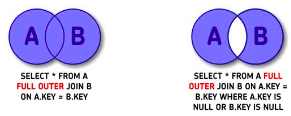
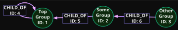
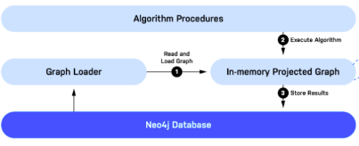
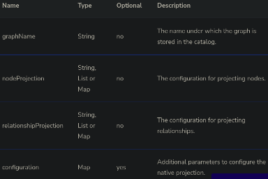
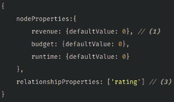
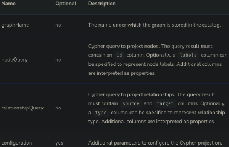



**Database**

[**1. Concepts	3**](#_mv2ptd27xg2u)**

[a. Columnar Vs Row Oriented Database	3](#_an1xnl7khfyh)

[b. Data Warehouse	3](#_bpd8fu97lp3p)

[c. Data Lake	4](#_1m3ok66ew3c2)

[d. RDBMS	4](#_8oyf1ylyq8vd)

[e. NoSQL	5](#_7n9213utdptg)

[**2. Query Languages	6**](#_uwbuc9yqgrpd)

[a. SQL	6](#_na1f5pazecf9)

[b. Cypher	11](#_glers8jpp8fm)

[**3. MySQL	14**](#_dzwkflt396tu)

[Concepts	14](#_384c7fed4mcu)

[Data Type	14](#_vgf4j7uh16f)

[Commands Lines	18](#_m28mt4gg1h90)

[**4. PostgreSQL	20**](#_1m68gez280y8)

[Concepts	20](#_499mm6if58pp)

[Data Types	20](#_lr2koi20v292)

[Command Lines - Psql	21](#_fu2a0bp2ak9l)

[**5. MongoDB	22**](#_q69znej4690v)

[Concepts	22](#_wiovdvs4yvo9)

[Data Types	23](#_w4nftoc4xjo9)

[Command Lines - mongosh	24](#_52l6ose4pxlo)

[**6. GCloud	26**](#_lx1m322oyxak)

[CLI	26](#_fkxh9bhqph6g)

[**7. Neo4j	27**](#_osq3brjs6qeb)

[a. Shell commands	27](#_rnbni2gkty9h)

[b. Property graph	27](#_b1gm07fmu9gc)

[c. Index-Free Adjacency - IFA	27](#_keb56qvljkng)

[d. Storage	28](#_vlhgwttuqbq2)

[e. Graph Data Modeling	28](#_g31mlnbc5utv)

[f. Graph Data Science	31](#_vb58fxkm9u80)

[g. Connection - Python	40](#_r89nu5h4w86t)

[h. …	41](#_2ldt89sybnxv)

1. # **Concepts**

1. ## Columnar Vs Row Oriented Database
**Row Oriented Databases** are databases that organize data by record.

Keep all of the data associated with a record next to each other in memory *- store per row, one after another*.

Add new data by appending the row in the end of the file.

Good to retrieve one or more rows, but slow to make agg *- too much memory*.

Are the traditional way of organizing data and still provide some key benefits for I/O data quickly *- they’re optimized for reading and writing rows efficiently*.

**Ex:** *Postgres - MySQL*

**Column Oriented Databases** are databases that organize data by field.

Keep all of the data associated with a field next to each other in memory *- store per field, one after another*.

Add new data by navigating and find the right position to add the data.

Can store each field in a different disk, so help with aggregations.

Have grown in popularity and provide performance advantages to querying data *- they’re optimized for reading and computing on columns efficiently*.

**Ex:** *Redshift - BigQuery - Snowflake*

1. ## Data Warehouse
Is where you store data from multiple data sources to be used for historical and analysis reporting. Store only highly structured and unified data.

It acts as a central database/repository for collecting data from many database sources and contains the *single version of truth*.

It is NOT to be used for OLTP applications. Uses the ETL process.

Born to reduce additional stress on the production system, optimized for read access, keep historical records, integrate with BI solution on top.

*Higher cost  -  longer implementation time  -  simple maintenance*

1. ## Data Lake
A data lake is a repository that stores all of your organization's data *- structured and unstructured*. Uses the ELT process.

Think of it as a massive storage pool for data in its natural, raw state *- like a lake*.

Can handle the huge volumes of data that most organizations produce without the need to structure it first. 

Data stored in a data lake can be used to build data pipelines to make it available for data analytics tools to find insights that inform key business decisions.

Data is available for use far faster by keeping it in a raw state.

*Lower cost  -  fast implementation  -  difficult maintenance*

1. ## RDBMS
**‘R**elational **D**ata**B**ase **M**anagement **S**ystem’

Is a system that is based on the relational model as introduced by E. F. Codd.

Data is stored in database objects which are called **tables**, which is basically a collection of related data entries and it consists of numerous **columns**/**fields** and **rows**/**records**.

**NULL value** in a table is a value in a field that appears to be *blank*, with no value.

**SQL Constraints** are the rules enforced on data columns on a table. These are used to limit the type of data that can go into a table. So ensures the accuracy and reliability of the data in the database. Constraints can either be column level or table level.

**Data Integrity** exist with each RDBMS:

*Entity Integrity:* there are no duplicate rows in a table.

*Domain Integrity:* enforces valid entries for a given column by restricting the type, the format, or the range of values.

*Referential integrity:* rows cannot be deleted, which are used by other records.

*User-Defined Integrity:* enforces some specific business rules that do not fall into entity, domain or referential integrity.

**Normalization** is the process of efficiently organizing data in a database.

2 reasons, (1) eliminating redundant data and (2) ensuring data dependencies make sense

consists of a series of guidelines

*First Normal Form - 1FN:* if the relation contains an atomic value, i. e., only single-valued attributes.

*Second Normal Form - 2FN:* if the relation is in 1FN and all non-key attrs are fully functional dependent on the primary key, i. e., any partial dependencies.

*Third Normal Form - 3FN:* if the relation is in 2FN and there is no transition dependency.

1. ## NoSQL
*not only SQL*, are non-tabular databases 

has a variety of types based on their data model

they provide flexible schemas and scale easily with large amounts of data and high user loads

Features

- flexible schemas  &  horizontal scaling
- fast queries due to the data model
- ease of use for developers

Types

Document databases

store data in documents similar to JSON objects

each document contains pairs of fields and values

values can typically be a variety of types *- like strings, numbers, booleans, arrays, or objects*

collections can contain multiples documents *- they can be different*

**Ex:** MongoDB

Key-value

are a simpler type of database where each item contains keys and values

**Ex:** Redis

Wide-column

store data in tables, rows, and dynamic columns

**Ex:** Cassandra and HBase

Graph

store data in nodes and edges

**Ex:** Neo4j
1. # **Query Languages**

   1. ## SQL
use to create, modify and extract data from the relational database, as well as control user access to the database.

used for RDBMS and the keywords are not case sensitive.

DQL *- Data Query Language*

command used so that we can query the data.

DML *- Data Manipulation Language*

commands used to manipulate data in the database.

DDL *- Data Definition Language*

commands used to create tables, views, indexes, update these structures, as well as remove.

DCL *- Data Control Language*

commands used to control access to database data, adding and removing access permissions.

DTL *- Data Transaction Language*

commands used to manage transactions performed on the database, such as starting a transaction, committing it, or rolling it back.

Data Types

access: <https://www.w3schools.com/sql/sql_datatypes.asp>

access: <https://www.tutorialspoint.com/sql/sql-data-types.htm>

Operators

access: <https://www.w3schools.com/sql/sql_operators.asp>

access: <https://www.tutorialspoint.com/sql/sql-operators.htm>

*result-set1* UNION *result-set2*

Arithmetic

\+   addition         \*  multiplication      /  division

\-    subtraction    %  modulus (remainder from division)

Comparison

=  equal	           >  greater than	    >=  greater than or equal to

!= <>  not equal	<  less than	    <=  less than or equal to

Logical

AND		OR		NOT		UNIQUE

IS NULL	LIKE *pattern*	IN		EXISTS

BETWEEN *value1* AND *value2*

Wildcards

For operator LIKE

% represents zero, one or multiple characters

\_ represents one

SELECT

1. DML
1. retrieves certain records from one or more tables
1. returned is stored in a result table, called result-set

DISTINCT: return only different values

FUNC: aggregate function, like MIN(), MAX(), COUNT(), AVG(), SUM()

\*: return all columns

CASE: goes through conditions and return a value when its met

WHERE: used to filter records - will use some operators

GROUP BY: groups rows with same value into summary rows - use agg func

HAVING: filtered records when use aggregate funcs - will use some operators

ORDER BY: sort the result-set in asc (default) or desc order

*SELECT [ DISTINCT ] column1 AS col1, [ FUNC(column2) ], [ \* ], [ CASE*

*WHEN condition1 THEN result1*

*WHEN condition2 THEN result2*

*…*

*ELSE result*

`    `*END ], …* 

*FROM table\_name*

*[ WHERE condition ]*

*[ GROUP BY column1 ]*

*[ HAVING condition ]*

*[ ORDER BY column1 [ ASC|DESC ], column2, …  ASC|DESC ];*

UPDATE

1. DML
1. modifies existing records in a table

   WHERE: will select the records to modify - will use some operators

*UPDATE table\_name*

*SET column1 = value1, column2 = value2, ...*

*[ WHERE condition ];*

DELETE

1. DML
1. delete existing records in a table

   WHERE: will select the records to delete - will use some operators

*DELETE* 

*FROM table\_name* 

*[ WHERE condition ];*

INSERT

1. DML
1. creates a record, i. e., insert a new record in a table
1. no need of columns name if all field is being filled

   VALUES: tuple of values that will be inserted

*INSERT INTO table\_name (column1, column3, ...) ]*

*VALUES (value1, value3, ...);*

CREATE

1. DDL
1. creates databases or tables

*CREATE ( DATABASE | TABLE ) name;*

ALTER

1. DDL
1. used to add, delete or modify columns in an table

*ALTER TABLE table\_name*

*( ADD col\_name type |*

`  `*DROP COLUMN col\_name |*

`  `*ALTER COLUMN col\_name type );*

DROP

1. DDL
1. deletes a entire *table*, *view* or other objects

*DROP ( DATABASE | TABLE ) name;*

CREATE VIEW

1. DDL
1. creates a virtual table based on the result-set
1. the database engine recreates the view every time a query use it
1. with REPLACE, can updated it
1. exists the *DROP VIEW view\_name;*

*CREATE [ OR REPLACE ] VIEW view\_name AS*

*SELECT clause*

CREATE INDEX

1. DDL
1. creates an index (search key) on a table
1. retrieve data more quickly
1. exists the *DROP* one

*CREATE [ UNIQUE ] INDEX index\_name*

*ON table\_name (column1, column2, …)*

GRANT

1. DCL
1. gives a privilege to a user

REVOKE 

1. DCL
1. takes back privileges granted from user

Stored Procedure

can save a query, so can be reused over and over again

*CREATE PROCEDURE procedure\_name*

*AS*

*sql\_statement*

*GO;*

to execute a procedure

*EXEC procedure\_name;*

JOIN

used to combine rows from two or more tables, based on a related column between them

can be a (INNER) JOIN or LEFT/RIGHT/FULL (OUTER) JOIN

*SELECT column1*

*FROM table1*

*INNER JOIN table* 

*ON table1.col=table2.col;*

SQL Constraints

specify rules for data in a table, used in CREATE TABLE

Possibles Constraints:

NOT NULL  *ensures that a column cannot have a NULL value*

DEFAULT value *provides a default value for a column when none is specified*

UNIQUE  *ensures that all the values in a column are different*

PRIMARY Key  *uniquely identifies each record in a database table*

FOREIGN Key  *uniquely identifies a record in any other database table*

CHECK  *ensures that all values in a column satisfy certain conditions*

INDEX  *used to create and retrieve data from the database very quickly*

*CREATE TABLE table\_name (*

`    `*column1 type constraint AUTO\_INCREMENT,*

`    `*column2 type constraint,*

`    `*column3 type constraint,*

`    `*....*

*);*

1. ## Cypher
   is a query language designed for graphs

   used for NoSQL databases - Neo4j

   the difference in queries is typically its traversal performance

   the anchor will be based upon the fewest numb of nodes that need to be retrieved

   have a label on the non-anchor node forces a label check *- lost performance*

using subqueries enables you to reduce the amount of rows processed in a query

to define and initialize variables, use: WITH ‘value’ AS varName  *- can use in the query*

*(n1: LabelN1 { properties: value }) -- [r:TYPE\_REL] -> (n2: LabelN2)*

`	`*pattern*

1. CREATE
   1. creates and insert a new node - with(out) relationship

`     `CREATE (n: Node { properties: value });

`   `CREATE (nSource: Node) - [r: Rel] -> (nDest: Node);

1. RETURN
   1. the return of some query
   1. can specify the node/relationship and the property
   1. use DISTINCT to eliminate duplicate results
   1. can apply numeric and string operation on the returned data
   1. *count():* add to make aggregation  - for more see [here](https://neo4j.com/docs/cypher-manual/current/functions/aggregating/)

      ` `all non-agg columns become grouping keys

the grouping is implicitly done, based upon the fields in RETURN

count(n) will use all non-null occurrence of col

count(\*) will use all rows retrieved *- including those with null values*

1. *LIST:* can return one as RETURN [ n.prop1, n.prop2 ]  - for more see [here](https://neo4j.com/docs/cypher-manual/current/functions/list/)

`			         `create one using collect( (DISTINCT) n.prop )	 *- optional distinct*

`			         `to access a element *or* slice: collect(n.prop)[0] *or* [2..]  *- using index*

1. *CASE:* conditionally changing data returned
1. *Special Case*: return a object that contains all of the property values

`           `do not contain any internal info, lika labels or id

`           `can create new properties - only exists in the results

`           `{ .\* } will return all properties 

RETURN n1, n1.prop1, n1.prop2 \* 2, 

`		          `CASE

`		          `WHEN cond1 THEN resp1

`		          `….

`		          `ELSE default Resp

`		          `END

` `RETURN n { .nameProp, …, newProp: value }	*Special Case*

1. (OPTIONAL) MATCH
   1. retrieve data from the graph
   1. match patterns - like nodes and relationship
   1. analogous to the FROM clause in an SQL statement
   1. *Optional Match:* if not found, will use nulls for missing parts
   1. the alternative use will return all nodes that are **2 to 4** hops away from n1 
   1. need a RETURN

      MATCH (n1: LabelN1), …	  	*or*

      MATCH (n1: LabelN1 {prop: value})-[:ACTED\_IN\***2 .. 4**]-(n2: LabelN2)

1. WHERE
   1. another way to filter queries - other way is { properties: value }
   1. can verify properties values, relationship types and nodes labels
   1. can add more logic to the clause 
      1. =  -  <>  -  <  -  <=  -  >  -  >=
      1. IS  -  NOT  -  NULL  -  OR  -  AND 
      1. IN  -  ENDS WITH  -  STARTS WITH
      1. CONTAINS  -  
      1. toUpper()  -  toLower()  -  exists{relationship}
      1. n:Label: test if the node has a label
      1. type(r): func to return the relationship type

` `WHERE n1.property = ‘Value’ AND n2.property = Numb

1. MERGE
   1. create a pattern in the database - single node or a relationship between two nodes
   1. **for nodes:** need to specify the Label and at least 1 Property - unique primary key
   1. **for relationships:** need to specify the Type and Directions - by default is left-to-right
   1. can chain multiple merge clauses together in a single code block
   1. eliminates duplication - check before create
   1. clause CREATE also create a node, but didn’t check before and don’t need a primary key
   1. can customizing the clausule behavior

      MERGE (n1: LabelN1 { properties: value })

      ON CREATE SET n1.property=’’ //set property if the pattern is created

      ON MATCH SET n1.property=’’ //set a property if the pattern was created

1. SET
   1. use to set or update some property value
   1. a reference to a node or relationship need to exist
   1. use MERGE and MATCH to reference
   1. use REMOVE to delete some property or setting it to null

      SET n1.property = [‘Value1’], r.property = null

1. ORDER BY
   1. used after the RETURN
   1. can specify a property value for the ordering
   1. str are ordered by their text values

      bools true comes before false and numerica

      data and datetime by their numeric value

   1. can be in ascending order *default*, or in descending order
   1. use LIMIT to specify the number of results returned
   1. use SKIP to skip some rows

      ORDER BY n1.property1 DESC, n1.prop2 LIMIT 10

1. DELETE
   1. use to delete nodes, relationships and properties
   1. a reference to it need to exist
   1. will node allows orphaned relationships (with only 1 node)
   1. use DETACH DELETE to delete the node and it’s incoming or outgoing relationships

      DELETE n1, r

1. PROFILE
   1. produce a query plan that show the query performance
   1. i.e., shows what operations occur during the query
   1. useful with a scaled graph

      PROFILE *query*

1. DATE and TIME
   1. use date(), datetime() or time() - for more see [here](https://neo4j.com/docs/cypher-manual/current/functions/temporal/)
   1. create from str: date(‘2022-01-01’) - datetime('2022-01-04T10:05:20')
   1. using duration: 

duration.between(dObj1,dObj2) *- between 2 dates objs* 

duration.inDays(dObj1,dObj2).days *- same as above, return in days* 

dObj1 + duration({months: 6}) *- add time*

1. .

1. # **MySQL**
GUI MySQL WorkBench and DBeaver
##
## Concepts
is an open source relational database management system (RDBMS)

written in C and C++

based on client-server model and on SQL

data is stored in a table

is capable of replicating data and partitioning tables

## Data Type

String

CHAR(size=1)

fixed length string 

can contain letters, numbers, and special characters

size specifies the length in characters - from 0 to 255

VARCHAR(size)

variable length string

can contain letters, numbers, and special characters

size specifies the max length in characters - from 0 to 65535

BINARY(size=1)

equal to CHAR()

but stores binary byte strings.

size parameter specifies the column length in bytes

VARBINARY(size)

Equal to VARCHAR()

but stores binary byte strings

size parameter specifies the maximum column length in bytes

TINYBLOB

for BLOBs (Binary Large Objects). Max length: 255 bytes

BLOB(size)

for BLOBs. Holds up to 65,535 bytes of data

MEDIUMBLOB

for BLOBs. Holds up to 16,777,215 bytes of data

LONGBLOB

for BLOBs. Holds up to 4,294,967,295 bytes of data

TINYTEXT

holds a string with a maximum length of 255 characters

TEXT(size)

holds a string with a maximum length of 65,535 bytes

MEDIUMTEXT

holds a string with a maximum length of 16,777,215 characters

LONGTEXT

holds a string with a maximum length of 4,294,967,295 characters

ENUM(val1, val2, val3, ...)

string object that can have only one value

chosen from a list of possible values.

can list up to 65535 values ​​in an ENUM list.

Numeric

add UNSIGNED option, it’ll disallows negative values

add ZEROFILL option, it’ll automatically adds UNSIGNED

BIT(size=1)

bit-value type

number of bits per value is specified in size - from 1 to 64

TINYINT(size)	

very small integer

signed range is from -128 to 127

unsigned range is from 0 to 255

size parameter specifies the maximum display width (255)

SMALLINT(size)

small integer

signed range is from -32768 to 32767

unsigned range is from 0 to 65535

size parameter specifies the maximum display width (255)

MEDIUMINT(size)

medium integer

signed range is from -8388608 to 8388607

unsigned range is from 0 to 16777215

size parameter specifies the maximum display width (255)

INT(size)	

normal integer

signed range is from -2147483648 to 2147483647

unsigned range is from 0 to 4294967295

size parameter specifies the maximum display width (255)

INTEGER(size)

equal to INT(size)

BIGINT(size)

large integer

signed range is from -9223372036854775808 to 9223372036854775807

unsigned range is from 0 to 18446744073709551615

size parameter specifies the maximum display width (255)

BOOL

zero is considered as false

nonzero values are considered as true.

BOOLEAN

equal to BOOL

FLOAT(size, d)

floating point number

total number of digits is specified in size. 

number of digits after the decimal point is specified in d 

syntax is deprecated in MySQL 8.0.17, and it will be removed

FLOAT(p)

floating point number

the p value to determine whether to use FLOAT or DOUBLE for the resulting data type

if p is from 0 to 24, the data type becomes FLOAT()

if p is from 25 to 53, the data type becomes DOUBLE()

DOUBLE(size, d)

normal-size floating point number

total number of digits is specified in size

number of digits after the decimal point is specified in d

DOUBLE PRECISION(size, d)	 

DECIMAL(size, d)

exact fixed-point number

total number of digits is specified in size

number of digits after the decimal point is specified in d

size: max number is 65 - default is 10

d: max number is 30 - default is 0

DEC(size, d)	Equal to DECIMAL(size,d)

Date and Time

DATE	

a date

format: YYYY-MM-DD

supported range is from '1000-01-01' to '9999-12-31'

DATETIME(fsp)

date and time combination

format: YYYY-MM-DD hh:mm:ss

supported range from '1000-01-01 00:00:00' to '9999-12-31 23:59:59'

Automatic initialization and updating to the current date and time can be specified using DEFAULT CURRENT\_TIMESTAMP and ON UPDATE CURRENT\_TIMESTAMP in the column definition

TIMESTAMP(fsp)

a timestamp

format: YYYY-MM-DD hh:mm:ss

supported range from '1970-01-01 00:00:01' UTC to '2038-01-09 03:14:07' UTC

values are stored as the number of seconds since the Unix epoch ('1970-01-01 00:00:00' UTC)

Automatic initialization and updating to the current date and time can be specified using DEFAULT CURRENT\_TIMESTAMP and ON UPDATE CURRENT\_TIMESTAMP in the column definition

TIME(fsp)

a time

format: hh:mm:ss

supported range is from '-838:59:59' to '838:59:59'

YEAR	

year in four-digit format

values allowed in four-digit format: 1901 to 2155, and 0000.

## Commands Lines

1. Basic Commands
   1. ***$*** sudo systemctl start mysql        #start mysql service
   1. ***$*** sudo systemctl stop mysql         #stop mysql service
   1. ***$*** sudo systemctl status mysql      # mysql service status

1. Other Commands
   1. Dump all databases for backup

***$** mysqldump -u username -p pass --opt >/tmp/db\_name.sql* 

1. Dump one databases for backup

***$** mysqldump -u username -p pass --databases db\_name >/tmp/db\_name.sql*

1. Dump a table from a database

***$** mysqldump -c -u username -p pass db\_name table\_name >/tmp/db\_name.table\_name.sql*

1. Restore database or table from backup

***$** mysql -u username -p pass db\_name >/tmp/db\_name.sql*

***$** mysql -u username -p pass db\_name table\_name >/tmp/db\_name.table\_namesql*

1. Login - one or another
   1. ***$*** sudo mysql -h hostname -u root/username -p
   1. ***$*** sudo mysql -u root/username -p
   1. ***$*** sudo mysql

*User root - password Omoplata1*

*User salomaoalves - password omoplatA1#*

1. Change Password

   ***$*** mysqladmin UserPassword -u UserName -p

   ***$*** mysqladmin -u UserName -p Password ‘NewPassword’ unix shell

1. When is logged
   1. view existing databases

***mysql>*** show databases;

1. identified the bank you need

***mysql>*** use bank\_name;

1. view the existing tables;

***mysql>*** show tables;

1. describe, to see information about tables

***mysql>*** describe table\_name;

***mysql>*** desc table\_name;

1. create a new bank

***mysql>*** create database database\_name;

1. create a table, inserting data, updating and deleting
   1. use any sql-statements

      ***mysql>*** SQL-statement

      ***mysql>*** select \* from table\_name; #query the data from the tables

1. delete record, table or database;

***mysql>*** delete from person where person.name = 'Mathues';

***mysql>*** drop table table\_name

***mysql>*** drop database database\_name;

1. exit mysql

***mysql>**  \q*

1. .

1. .

1. # **PostgreSQL**
DBeaver
##
## Concepts
enterprise-class and open-source relational database system 

supports both SQL (relational) and JSON (non-relational) querying

## Data Types
Boolean 

or Bool: hold one of three possible values: true (1, yes, y, t, true), false (0, no, false, f) or null ('space').

Character

**CHAR(n)** is the fixed-length character with space padded.

**VARCHAR(n)** is the variable-length character string, so can store up to n characters.

**TEXT** is the variable-length character string. Theoretically, text data is a character string with unlimited length.

Numeric

**SMALLINT** is a 2-byte signed integer that has a range from -32,768 to 32,767.

**INT** is a 4-byte integer that has a range from -2,147,483,648 to 2,147,483,647.

**FLOAT(n)**  is a floating-point number whose precision, at least, n, up to a maximum of 8 bytes.

**REAL** or **FLOAT8** is a 4-byte floating-point number.

**NUMERIC** or **NUMERIC(p,s)** is a real number with p digits with s number after the decimal point.

Temporal

**DATE** stores the dates only.

**TIME** stores the time of day values.

**TIMESTAMP** stores both date and time values.

**TIMESTAMPTZ** is a timezone-aware timestamp data type. extension to the SQL standard’s temporal data types.

**INTERVAL** stores periods of time.

## Command Lines - Psql
1. Login - one or another

***$*** sudo su postgres -c psql postgres               #access local bank

***$*** psql -h 127.0.0.1 -U postgres -d mybank     #access another bank

***$*** psql -d database -U user -W	             #access a database of user

***$*** psql -h host -d database -U user -W	 #in another host

1. When is logged
   1. Switch connection to a new database

***postgres=#*** \c dbname

1. List available databases

***postgres=#*** \l

1. List available tables

***postgres=#*** \dt

1. Describe a table

***postgres=#*** \d table\_name

1. List all schemes of the currently connected database

***postgres=#*** \dn

1. List available functions in the current database

***postgres=#*** \df

1. List available views in the current database

***postgres=#*** \dv

1. List all users and their assign roles

***postgres=#*** \du

1. Retrieve the current version of PostgreSQL server

***postgres=#*** SELECT version();

1. Execute the last command again

***postgres=#*** \g

1. Display command history

***postgres=#*** \s

1. Save the command history to a file

***postgres=#*** \s filename

1. Execute psql commands from a file

***postgres=#*** \i filename

1. Know all available psql commands

***postgres=#*** \?

1. exit

   ***postgres=#*** \q

1. .

1. # **MongoDB**
DBeaver
##
## Concepts
source-available cross-platform document-oriented database program

NoSQL database program - uses JSON-like documents with optional schemas

It’s a **server** with multiple **databases**, which contain multiple **collections** *(can contain Validation Rules)*, which contain multiple **documents** with different schema/structure *(Schema-Less Database)*.

Is a **distributed database** at its core, so high availability, horizontal scaling and geographic distribution are built in.

*Write operation* is **atomic** on the level of a single document, so if it modifies multiple documents, the modification of each document is atomic, but the operation as a whole is not atomic.

**Normalized** data models are when the references store the relationships between data including links or references from one document to another. The **Denormalized** data models will store a sub-document, what is called *Embedded Data*.

Support **Ad-hoc queries**: field, range and regular-expression queries which can return entire documents, specific fields of documents or random samples of results.

**Aggregation** allows to perform operations on the grouped data and get a single result or computed result *- similar to the SQL GROUPBY clause*. It provides three different aggregations: aggregation pipeline, map-reduce function, and single-purpose aggregation methods.

Provides **Horizontal Scalability** with the help of sharding *- distribute data on multiple servers*. Using a *shard key*, a large amount of data is partitioned into *data chunks* and, these data chunks, are distributed, by a *balancer*, across *shards* that reside across many physical servers. It will also add new machines to a running database.

**Replication** provides high availability and redundancy. It creates multiple copies of the data and sends these copies to a different server. So if one server fails, then the data is retrieved from another server and can increase data locality and availability.

Every field in the documents is **indexed** with primary and secondary indices. This makes it easier and takes less time to get or search data from the pool of the data. Without indexes, it must perform a *collection scan* - scan every document in a collection. The indexes store a small portion of the collection’s data set, ordered by the value of the field.

**Storage** **Engine** is the component responsible for managing how data is *stored*, both in memory and on disk *- different engines perform better for specific workloads*.

**WiredTiger** is the default *Storage Engine*. It’s well-suited for most workloads and is recommended for new deployments. Provides a *document-level concurrency model* for write operations *- multiple clients can modify different documents of a collection at the same time*, *checkpointing* *- every 60 secs or 2GB of journal data written*, *snapshots* *- MVCC -* and *compression*.

**In-Memory** *Storage Engine* will retain the documents stored in-memory, will not maintain *any on-disk data*, including configuration data, indexes, user credentials and so on. By avoiding I/O, it allows for more predictable data latencies.

Journaling helps the database recover in the event of a hard shutdown - it uses *write ahead logging* to on-disk *journal files*.
##

## Data Types
The data is stored in the format of BSON documents *- max size: 16MB*, which is the conversion of the JSON data into a binary form.

They have *( BSONType - Number - Alias )*: 

( Double - 1 - “double” ), ( String - 2 - “string” ), ( Object - 3 - “object” ), 

( Array - 4 - “array” ), ( Binary data - 5 - “binData” ), 

( Undefined - 6 - “undefined” ), ( ObjectId - 7 - “objectId” ), 

( Boolean - 8 - “bool” ), ( Date - 9 - “date” ), ( Null - 10 - “null” ), 

( Regular Expression - 11 - “regex” ), ( DBPointer - 12 - “dbPointer” ), 

( JavaScript - 13 - “javascript” ), ( Symbol - 14 - “symbol” ), 

( JS code w/ scope - 15 - “javscriptWithScope” ), ( 32-bit integer - 16 - “int” ), 

( Timestamp - 17 - “timestamp” ), ( 64-bit integer - 18 - “long” ), 

( Decimal128 - 19 - “decimal” ), ( Max/Min key - 127/-1 - “max/minKey” )

Timestamps 

is 64 bit value, where the most significant 32 bits are a *time\_t* value *- seconds since Unix epoch -* and the least significant 32 bits are an incrementing *ordinal* for operations within a given second.

Date 

is a 64-bit integer that represents the number of milliseconds since the Unix epoch (Jan 1, 1970). Negative values represent dates before 1970.

## Command Lines *-* *mongosh*
1. Login - one or another

***$*** mongosh --host localhost --port 27017

***$*** mongosh

1. When is logged *- more methods [here*](https://www.mongodb.com/docs/manual/reference/method/)*

   1. Display current database

**>>>** db

1. Switch database

**>>>** db *dbName*

1. Set a database

**>>>** uses *dbName*

1. Insert a Collection *- if a collection doesn’t exist, one will be created*

**>>>** db.*CollectionName*.insertOne( { key: value }) *#only 1 record*

**>>>** db.*CollectionName*.insertMany([{ key: val }, { key: val }])

1. Select all document from a collection

**>>>** db.*CollectionName*.find( { } )

1. Filter Data

Use comparison operator for more advanced queries - see [here](https://www.mongodb.com/docs/manual/reference/operator/query/#query-selectors).

**>>>** db.*CollectionName.*find( { “F*key*”: “*ValueEqual*” $or

`     `*can mix vi and vii*                “F*key2*”: { *QueryOpt*:  “*Value*”, … }, …  } )	

1. Project Fields *- only FieldName will show - with 0 field will not show up*

**>>>** db.*CollectionName*.find( { }, {“*FieldName”*: 1} )

1. Update Single Document

Update the first document that matches the filter.

**>>>** db.*CollectionName*.updateOne( { “F*key*”: “*ValueEqual*” },{

$set: { plot: “This is the new plot!!!” }

{ $currentDate: { lastUpdated: true } } })

1. Update Multiple Documents

Update all documents that match the filter.

**>>>** db.*CollectionName*.updateMany( *same as above* )

1. Replace a document

The replacement doc must contain only field/value pairs *- no update opt exp -* and can have different fields.

**>>>** db.*CollectionName*.replaceOne({ key: val },{ key: val, key’: val’ })

1. Delete all document from a collection

**>>>** db.*CollectionName*.deleteMany( { } )

1. Delete all document that Match a Condition

**>>>** db.*CollectionName*.deleteMany( { “*key*”: “*ValueEqual*” } )

1. Delete the first document that Match a Condition

**>>>** db.*CollectionName*.deleteOne( { “*key*”: “*ValueEqual*” } )

1. Simple Agg

More stage [here](https://www.mongodb.com/docs/manual/reference/operator/aggregation-pipeline/) and pipeline opt [here](https://www.mongodb.com/docs/manual/reference/operator/aggregation/).

This agg will *(1)* make a projection with just some fields, *(2)* will separate this table into multiple ones, based on the genres, *(3)* take the rating average for each table created a step ago, and *(4)* will sort the data.

**>>>** db.*CollectionName*.aggregate([

{ $project: { \_id: 0, genres: 1, imdb: 1, title: 1 } },    *# 1 Stage*

{ $unwind: "$genres" },    *# 2 Stage*

{ $group:     *# 3 Stage*

`    `{ \_id: "$genres",

`      `averageGenreRating: { $avg: "$imdb.rating" }

`    `}

`  `},               *# 3 Stage - end*

{ $sort: { averageGenreRating: -1 } }   *# 4 Stage*

] )

1. Switch

**>>>** db.

1. # **GCloud**
   ## CLI
Return current project

sudo gcloud config get-value project

List all projects

sudo gcloud projects list

Set a new project as the current one

sudo gcloud config set project my-project-id

Upload the image to cloud run

sudo gcloud builds submit --tag gcr.io/YOUR\_PROJECT/my\_screenshot\_service

1. # **Neo4j** 
   <https://neo4j.com/docs/>

`  `*IDE*	Neo4j Desktop

*Books*	<https://neo4j.com/books/>

1. ## Shell commands
   `       `Doc: https://neo4j.com/docs/operations-manual/current/tools/cypher-shell/

   1. Initiate server

**$** sudo systemctl enable/stop neo4j.service

1. Start/Stop server

**$** sudo systemctl start/stop neo4j.service

1. Server status

**$** sudo systemctl status neo4j.service

1. Initiate shell command

**$** cypher-shell -u neo4j -p Omoplata1@ -d neo4j

1. ## Property graph
   1. **Nodes:** represent the things, now has labels - identifies that it belongs to a subset of nodes, 0 or more - and properties - key-value pairs, can be add or removed as necessary value can be a list or a single value
   1. **Relationships:** connections between two nodes, **must** have a direction, source and destination node **must** exist, must have a type - it’s name - and properties - key-value pairs, can be add or removed as necessary value can be a list [e1 e2] or a single value
##
1. ## Index-Free Adjacency - IFA
   When a database transaction is committed, a reference to the relationship is stored with the nodes at both start and end of that relationship.

   Every node is aware of every incoming and outgoing relationship connected to it.

   So, the underlying graph engine will simply chase pointers in memory.
   ##

1. ## Storage
Conceptually, the graph looks like:

`			`They are stored as:

1. ## Graph Data Modeling
the graph design needs to answer the key use cases for the application 

provide the best Cypher query performance for the key use cases

1. Data Model

describes the labels, relationships and properties for the graph

did not specific any data that will be created

**for labels:** 

first letter in upper case and can be CamelCase, 

e.g.: *Person* - *GitHubRepo*

**for types:** 

all letter in upper case

e.g.: *MARRIED\_TO*

**for property key:** 

all letter in lower case and can be camelCase

e.g.: *qty* - *firstName*

1. The Process
   1. Understand the domain and define specific use cases (questions)
      1. with the stakeholders and developers of the application
   1. Develop the Data Model
      1. Nodes/Entities

used to be the dominant nouns in the uses cases

normally, the label will be the noun itself

1. Nodes Properties

are used to:

1. uniquely identify a node
1. answer specific details of the use cases
1. return data
1. Relationships

used to be the verbs in the use cases

they’re connections between entities

type needs to be intuitive and clear

need to define a directions

1. Relationships Properties

are used to enrich how two nodes are related

some use case ask about how theys are related

1. Fanout

the entities are represented not as a single node, but as a network or linked nodes

e.g., also create nodes for the entities property

1. Test the uses cases against the initial data model
1. Create the graph with test data using Cypher - Instance Model
1. Test the uses cases, including performance against the graph
1. Refactor (improve) the graph data model
   1. graph does not answer all of the use cases
   1. a new use case has come up
   1. the cypher does not perform optimally, specially when the graph scales

1. Implement the refactoring on the graph and retest
   1. write cypher code to transform the existing graph to implement the new data model
   1. retest all use cases with updated or not Cypher code

1. Refactor
   1. Nodes Labels

helps to reduce the amount of data that is retrieved

i.e., reduce the size of the graph that is touched by a query

don’t do it 

1. semantically orthogonal labels, i.e., same labels in different contexts
1. representing class hierarchies - used nodes for this
1. Duplicate Data

duplication in graphs will increases the size of it and the 

amount of data that may need to be retrieved for a query

`	`de-duplicating data gives you the added benefit of allowing 

you to query through a node

`	`when duplication in nodes properties, mapping it as node

1. Specific Relationships

in some cases, it is more performant to query the graph 

bases upon relationship types, rather than properties in the nodes

`	`is specific to a node properties

`	`useful when the graph scaled

1. Intermediate Nodes

when a relationship wants to connect with more than two

nodes OR relate something to a relationship OR share data in the 

graph between entities

`	`it will create a new node

1. ## Graph Data Science
<https://neo4j.com/docs/graph-data-science/current/>

is delivered as library and a plugin - need to be installed as an extension 

has a community and enterprise license

`			`works by transforming and loading data into a in-memory format that is 

optimized for high-performance graph analytics

`			`provides graph algorithms, feature engineering and machine learning 

methods to execute on this in-memory graph format

`		`will use as much memory and CPU cores as it needs - respect user limits

1. Workflow
   1. **Read and Load Graph:** GDS reads data from Neo4j, transforms and loads it into an in-memory graph, called *graph projection*. Can hold multiple projection, managed by the *Graph Catalog*
   1. **Execute Algorithms:** includes classic graph algorithms (centrality, path finding, …), embeddings (a form of feature engineering in graph) and machine learning pipelines
   1. **Store Results:** enables to write results back to the database, export to disk in csv format or stream into another application or downstream workflow

1. Graph Catalog 

is a concept that allows you to manage graph projections in GDS

1. Operations     

   *CALL gds.graph.<command>**	 - general

- list the graph projections

CALL gds.graph.list()

- create projection

CALL gds.graph.project(projName, [Node1, Node2], [Rela1,Rela2])

- run degree centrality algorithm

`        `store the result in the node projection property ‘name’ 

CALL gds.degree.mutate(projName, {mutateProperty: ‘PropName’})  

`          `store the result in the database 

CALL gds.graph.writeNodeProperties(projName, [ResultNode], [DatabaseNode])

- export a graph into 

`          `a new database 

CALL gds.graph.export

`           `into csv files 

CALL gds.beta.graph.export.csv

- drop a projection 

CALL gds.graph.drop(projName)

1. Native Projections

are optimized for efficiency and performance to support graph 

data science at scale

recommended for development and production phases

read from the Neo4j store files directly using the function

gds.graph.project()

1. Features
   1. project node and relationship elements as-is from the database
   1. the inclusion of numeric node and relationship properties
   1. altering relationship direction or “orientation”
   1. aggregating parallel relationships

1. Syntax

the wildcard character \* can be used to include all nodes 

and/or relationships in the database					

1. Changing Relationship Orientation

in *.project()* at parameter *relationshipProjection*

1. NATURAL:  same direction as in the database (default)
1. REVERSE: opposite direction as in the database
1. UNDIRECTED: undirected

   { RATED\_BY: {type: ‘Rela1’, orientation: ‘REVERSE’}}

1. Adding Node and Relationship properties
   1. in *.project()* at parameter *configuration*
   1. *defaultValue* allows us to fill in missing values

1. Parallel Relationship Aggregations

is multiple relationships of the same type and direction 

between two nodes

you will aggregate, by using counts or sums or averages or 

…, into a single relationship in preparation for running graph algorithms or machine learning

1. Cypher Projections

are optimized for flexibility because of Cypher

customization to support exploratory analysis, experimentation 

and smaller graph projections

has diminished focus on performance relative to native projections 

and as a result won’t perform as quickly or as well on larger graphs

`	`will use when has Complex Filtering or Aggregating Multi-Hop 

Paths with Weights

1. Syntax

*gds.graph.project.cypher()*

**Ex:**

CALL gds.graph.project.cypher(

`   `'proj-cypher',

`   `'MATCH (a:Actor) RETURN id(a) AS id, labels(a) AS labels',

`   `'MATCH (a1:Actor)-[:ACTED\_IN]->(m:Movie)<-[:ACTED\_IN]-(a2)

`    `WHERE m.year >= 1990 AND m.revenue >= 1000000

`    `RETURN id(a1) AS source , id(a2) AS target, count(\*) AS actedWithCount, "ACTED\_WITH" AS type'

);

1. Graph Algorithms

1. Tiers

   **Production-quality:** algorithm has been tested in regard to stability and scalability.  	*gds.<algorithm>*

   **Beta:** algorithm is a candidate for the production-quality tier.  				*gds.beta.<algorithm>*

   **Alpha:** algorithm is experimental and might be changed or removed at any time.  	*gds.alpha.<algorithm>*

1. Execution Modes

   **Stream:** returns the result of the algorithm as a stream of records.

   **Stats:** returns a single record of summary statistics, but does not write to the Neo4j database or modify any data.

   **Mutate:** writes the results of the algorithm to the in-memory graph projection and returns a single record of summary statistics.

   **Write:** writes the results of the algorithm back to the Neo4j database and returns a single record of summary statistics.

1. Overall Algorithm Syntax

*CALL gds[.<tier>].<algorithm>.<execution-mode>[.<estimate>](*

`	`*graphName: STRING,*

`	`*configuration: MAP*

*)*

1. Centrality algorithms 

used to determine the importance of some node in a graph

1. Degree Centrality 

   is one of the most ubiquitous and simple centrality algorithms. It’ll counts the number of relationships a node has - specifically calculate out-degree centrality (count of outgoing relationships from a node)

   **Ex:**

   *CALL gds.degree.stream('proj')*

   *YIELD nodeId, score*

   *RETURN gds.util.asNode(nodeId).name AS name, score*

   *ORDER BY score DESCENDING, name LIMIT 5*

1. PageRank

   measure the influence of nodes in a directed graph

   particularly where the relationships imply some form of flow of movement such as in payment networks, supply chain and logistics

   estimates the importance of a node by counting the number of incoming relationships from neighboring nodes weighted by the importance and out-degree centrality of those neighbors

   **Ex:**

   *CALL gds.pageRank.stream('proj')*

   *YIELD nodeId, score*

   *RETURN gds.util.asNode(nodeId).name AS name, score*

   *ORDER BY score DESCENDING, name LIMIT 5*

1. Betweenness Centrality

   measures the extent to which a node stands between the other nodes in a graph

   It is often used to find nodes that serve as a bridge from one part of a graph to another

1. Eigenvector Centrality

   measures the transitive influence of nodes

   similar to PageRank, but works only on the largest eigenvector of the adjacency matrix so does not converge in the same way and tends to more strongly favor high degree nodes

   it can be more appropriate in certain use cases, particularly those with undirected relationships

1. Article Rank

   variant of PageRank which assumes that relationships originating from low-degree nodes have a higher influence than relationships from high-degree nodes

1. Path Finding

   find the shortest path between two or more nodes or evaluate the availability and quality of paths (Supply chain analytics, Customer Journey)

   1. Dijkstra Source-Target Shortest Path

      it computes the shortest path between a source and a target node and supports weighted relationships to account for any cost property when comparing paths
\*
`	`**Ex:**

*MATCH (a:Actor)*

*WHERE a.name IN ['Kevin Bacon', 'Denzel Washington']*

*WITH collect(id(a)) AS nodeIds*

*CALL gds.shortestPath.dijkstra.stream('proj',* 

`    `*{sourceNode:nodeIds[0],* 

`     `*TargetNode:nodeIds[1]})*

*YIELD sourceNode, targetNode, path*

*RETURN gds.util.asNode(sourceNode).name AS sourceNodeName,*

`    `*gds.util.asNode(targetNode).name AS targetNodeName,*

`  	    `*nodes(path) as path;*

1. A\* Shortest Path

extension of Dijkstra that uses a heuristic function to speed up computation

1. Yen’s Algorithm Shortest Path

extension of Dijkstra that allows you to find multiple, the top k, shortest paths

1. Dijkstra's Single-Source Shortest Path

Dijkstra implementation for shortest path between one source and multiple targets

1. Delta-Stepping Single-Source Shortest Path

parallelized shortest path computation

computes faster than Dijkstra single-source shortest path but uses more memory

1. Breadth First Search

searches paths in order of increasing distance from the source node on each iteration

1. Depth First Search

searches as far as possible along a single multi-hop path on each iteration

1. Community detection 

   are used to evaluate how groups of nodes may be clustered or partitioned in the graph

   1. Louvain 

      maximizes a modularity score for each community, where the modularity quantifies the quality of an assignment of nodes to communities

      this means evaluating how much more densely connected the nodes within a community are, compared to how connected they would be in a random network

   1. Label Propagation

      similar intent as Louvain

      fast algorithm that parallelism well

      great for large graphs

   1. Weakly Connected Components (WCC)

      partitions the graph into sets of connected nodes such that

      1. every node is reachable from any other node in the same set
      1. no path exists between nodes from different sets

   1. Triangle Count

      counts the number of triangles for each node

      can be used to detect the cohesiveness of communities and stability of the graph

   1. Local Clustering Coefficient

      computes the local clustering coefficient for each node in the graph which is an indicator for how the node clusters with its neighbors

1. Node Embedding 

   compute low-dimensional vector representations of nodes such that similarity between vectors (eg. dot product) approximates similarity between nodes in the original graph

   these vectors, also called embeddings, can be extremely useful for exploratory data analysis, similarity measurements, and machine learning

   1. FastRP 

      leverages probabilistic sampling techniques to generate sparse representations of the graph allowing for extremely fast calculation of embedding vectors

   1. Node2Vec

      computes a vector representation of a node based on random walks in the graph

   1. GraphSage

      is an inductive modeling approach for computing node embeddings using node properties and graph structure

1. Similarity algorithms

   used to infer similarity between pairs of nodes

   run over the graph projection in bulk

   when similar node pairs are identified according to the user specified metric and threshold, a relationship with a similarity score property is drawn between the pair

1. Node Similarity

   determines similarity between nodes based on the relative proportion of shared neighboring nodes in the graph. 

   good choice when explainability is important, and you can narrow down the universe of comparisons to a subset of your data

1. K-Nearest Neighbor (KNN)

   determines similarity based off node properties

   can scale well for global inference over large graphs when tuned appropriately

   can be used in conjunction with embeddings and other graph algorithms

1. Machine Learning

   handle with models and pipelines, and some resources for pre-processing, hyperparameter tuning, and training methods

   pipeline step

project a graph and configure the pipeline (the order doesn’t matter)

execute the pipeline with a train command

predict on a projected graph with the predict command

1. Node Classification Pipelines

supervised binary and multi-class classification for nodes

1. Link Prediction Pipelines

   supervised prediction for whether a relationship or "link" should exist between pairs of nodes

1. .

1. ## Connection - Python
use library neo4j

1. Drive Instance

use function neo4j.GraphDatabase.driver() to create

will open multiple TCP connections

Param ‘Connection String’

*Scheme*://InitialServerAddress:Port?AdditionalConfig

1. Scheme used to connect to the Neo4j instance

**‘neo4j’** **-** unencrypted connection

**‘neo4j+s’** **-** encrypted connection, will verify the authenticity of the certificate

**‘neo4j+scc’** **-** encrypted connection, won’t verify the authenticity of the certificate

1. InitialServerAddress for the Neo4j DBMS

‘localhost’

‘dbhash.database.neo4j.io’

1. Port number that the DBMS is running - *default 7687*
1. Additional connection config

some routing context

Param ‘Auth’

basic authentication consisting of a username and pass

can pass both as a tuple

Param ‘Additional Driver Config’

it’s optional

provide advanced config

1. Sessions

is a container for a sequence of transactions

will borrow connections from a pool as required

considered lightweight, disposable and a client-side abstraction

driver.session(database=’db\_name’)

Param ‘database’ is optional, used to set the database to run any query. The default is ‘neo4j’ and it is found in ‘neo4j.conf’ at ‘dbms.default\_dabase’.

1. Transactions

comprises a unit of work performed against a database

it’s treated in a coherent and reliable way

is ACID - atomic, consistent, isolated and durable

1. Auto-commit

single unit of work that are immediately executed

use driver.sessions().run()

1. Read and Write

   the unit of work is a function

   the first parameter passed to the function will be a transaction object, from it, executed using the tx.run()

   in case of any problem, it will be automatically rolled back - on write

1. Manually Creating Transactions

use driver.session.begin\_transaction()

need to be manually committed or rolled back

1. Results

consumed as a stream of records

acts as a buffer for a iterable list of records

once consumed, it is removed from the buffer

1. Data Types

Datetime: ‘neo4j.time. Date() .Time() .DateTime() .Duration()’

Point: ‘neo4j.spatial.Point()

Cartesian Point: ‘neo4j.spatial.CartesianPoint(X, Y, Z)’

WGS83 Point: ‘neo4j.spatial.WFS84Point(longitude, latitude)’

1. Exception Types

general error ‘neo4j.exceptions.Neo4jError’

client sent a bad request ‘neo4j.exceptions.ClientError’

1. ## …

