#

**Physics**

“science concerned with the nature and properties of matter and energy”

[**Measurement Units](#_yiezmc5fricg)	**4****

[**Classical Mechanics](#_erpuaufchsxn)	**7****

[Kinematics](#_7y11navwapau)	7

[Dynamics](#_6hl26mus3xs8)	10

[Statics](#_r7gdhds2c2ci)	13

[**Fluid Mechanics](#_j6vfnvecmspz)	**14****

[Concepts](#_exirlxld92aq)	14

[General Equation of Perfect Gas](#_u2k3vrgqd4k)	15

[Hydrostatics](#_yu69s338smiw)	16

[Hydrodynamics](#_vcp8vvrg6jaz)	17

[**Thermal Physics](#_efnq3jw5fy51)	**19****

[Temperature](#_n8cog5td6qz8)	19

[Heat](#_oqv7uiuixec4)	19

[Thermal Expansion](#_hjul6u5n4pi4)	20

[Internal Energy (U)](#_m6rvt2nju4mo)	20

[Thermodynamics](#_7tvlwvcw89yu)	20

[Laws of Thermodynamics](#_lmnaajf3n8lx)	20

[**Waveform](#_ddr0m4v28zjq)	**23****

[Types of waves](#_bzm2j2jhcyzj)	23

[Concepts](#_1vb2ntda07r4)	24

[Wave behavior](#_1wytui9c7lsl)	24

[Doppler Effect](#_gvbnbqozgimg)	25

[**Optics](#_dfyjcxh5pc8b)	**26****

[Physical/Wave optics](#_tprattc2z6rl)	26

[Geometrical optics](#_5dmlywt9xj64)	26

[Reflection](#_tdg5seo9sexx)	27

[Refraction](#_xya1xtfl1at1)	27

[Dispersion](#_avr5kujrdl24)	28

[Mirrors](#_n1x8oh3c7etm)	28

[Lens](#_qol7x05y2qhn)	30

[**Electricity & Magnetism](#_2jpiunrazv1f)	**33****

[Electricity](#_xq1mq487zal1)	33

[Magnetism](#_wpsnw0xjnjjr)	34

[Electrical Network - Circuits](#_n7uq2dwkg6ii)	35

[Electrostatics](#_2ky1t1baml1n)	36

[Electrodynamics](#_b8gpulxuzs3v)	37

[Electromagnetism](#_xtg4allwpdum)	37

[Electrochemistry](#_i3i94441yq5v)	38

[**…](#_vw7248b9icx)	**38****

1. # **Measurement Units**

   1. Distance

      is the distance traveled by light in a vacuum a time interval of 1/299792458 of a second

      ***meter (m)**; mile (mi); nautical mile (nmi); yard (yd); feet (ft or ’); inch (in or ’’)*

`  `1’    =     12’’

1 yd  =  91.44 cm

1 in   =   2.54 cm

` `1 ft   =  30.48 cm

1\.5 m  =     4’ 11’’

1 nmi  =   1.852 km

` `1 mi   =  1.6093 k

1. Mass

   is the planck constant h to be 6.62607015\*10-34J

   ***kilogram (kg)**; pounds (lb); ounce (oz)*

50 kg  =  110.23 lb

`  `1 lb   =     16 oz

` `1 lb  =    0.453 kg

1 oz  =  28.3495 g

1. Time

   is the duration of 9192631770 periods of radiation corresponding to the transition between the two hyperfine levels of the ground state of the cesium-133 atom

   ***second (s)***

1. Electric Current

   is the elementary charge *e* to be 1.602176634\*10-19C

   ***ampere (A)***

1. Luminous Intensity

   is the value of the luminous efficacy of monochromatic radiation of frequency 540\*1012Hz

   ***candela (cd)***

1. Amount of Substance

   contains exactly 6.02214076\*1023 elementary entities

   ***mole (mol)***

1. Temperature

   is the fraction 1/273.16 of the thermodynamic temperature of the triple point of water

   ***Kelvin (K)**; celsius (ºC); fahrenheit (ºF)*

*1 K  =  0.01 ºC  =  0.018 ºF*

*1 ºC = 1.8 ºF*

*k = c + 273.15*

*k = (f + 459.67) \* 1.8*

*c = k - 273.15*

*c = (f - 32) / 1.8*

*f = 1.8k - 459.67*

*f = 1.8c + 32*

1. Others
   1. speed

*meter per second (m/s); kilometer per hour (km/h); miles per hour (mph)*

1 m/s = 3.6 km/h

1 km/h = 0.6213 mph

1. acceleration

*meter per second squared (m/s²); kilometer per hour squared (km/h²)*

1 m/s² = 12960 km/h²

1. volume

*cubic meter (m³); liter (l)*

1 l = 1 dm³

1 ml = 1 cm³

1. electric potential difference

*volt (V)*

1 V = 1 W/A

1. electric resistance

*ohm (*Ω*)*

1 Ω = 1 V/A

1. energy transfer

*watt (W)*

1 W = 1 J/s

1. area

*square meter (m²)*

1. concentration

*mole per cubic meter (mol/m³)*

Prefixes

deci (d)    =   10-1

centi (c)   =   10-2

mili (m)    =   10-3

micro (μ)  =   10-6

nano (n)   =   10-9

pico(p)     =   10-12

femto (f)   =   10-15

atto (a)     =   10-18

zepta (z)   =   10-21

yocta (y)   =   10-24

deca (da)  =   101

hecta (h)   =   102

kilo (k)       =   103

mega (M)  =   106

giga (G)     =   109

tera (T)      =   1012

peta (P)     =   1015

exa (E)      =   1018

zetta (Z)    =   1021

yotta (Y)    =   1024

1. # **Classical Mechanics**
is the 3 main formulations of pre-relativistic mechanics: Newtonian, Lagrangian and Hamiltonian.

subdivided into Statis, Kinematics and Dynamics, also includes Fluid mechanics, Thermology, Waveforms, Optics and Electricity

responsible for the study of the motion of the bodies, as well as their temporal evolution and the mathematical equation that determine them

1. ## Kinematics
   study of the behavior of motions

   **Motion Classification				      →→ (s)**   

   v > 0, a < 0 → Progressive Delayed             (a)← &→(v)

   v > 0, a > 0 → Progressive Accelerated      &→(v and a)

   v < 0, a < 0 → Retrograde Delayed              (v and a)← &

   v < 0, a > 0 → Retrograde Accelerated       (v)← &→(a)

   1. Uniformly Rectilinear Motion - URM

it is always that a body travels a certain distance in a certain time, that is, v=cst≠0

*Average Speed Vave=ΔSΔt*

*Position  S=S0+v\*t*

1. Uniformly Accelerated Rec. Motion - UARM

it is always that a bodies varies in velocity in equal amounts in the same time interval, that is, a=cst≠0

*Acceleration  aave=ΔvΔt*

*Position  S=S0+v0\*t+a\*t²2*

*Speed  V=V0+a\*t*

*Torricelli Equation  v²=v02+2\*a\*ΔS*

1. Types of Launch
   1. Vertical

it’s a vertical motion

oriented up

a UARM		

*earth gravity = 9.807 m/s*

v0≠0  and  a=g<0  and  ΔS=H(high)

1. Free Fall

vertical motion

oriented down

a UARM

v0 not null  and  a=g>0  and  S-S0=H(high)

1. Horizontal

motion performed by a body that was thrown

the result of two motions

1) URM in axis x
1) UARM in axis y *- free fall*

launch angle α=90*°*  and  v0=cst

vx=v\*cos(α)  and  vy=v\*sin(α)

1. Projectile Motion

motion performed by a object that was launched diagonally

the result of three motions

1) URM  in axis x
1) UARM in axis y *- first half of t vertical*
1) UARM in axis y *- second half of t free fall*

0°≤α≤90*° and v0=cst*

*Max High  H=v02\*sin2α2\*g*

*Max Reach*  Δ*S=v02\*sin(2α)g*

*(De)Ascent Time  t=v0yg*

1. Circular Motion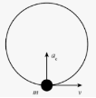

is whenever a body moves along a circular path

r, v and ω (rad/s) are cst  and  ∃ac

ω *(angular velocity) in rad/s*

*T (period) in seconds ; f (frequency) in Hz*

*Arc of the Circumference  C=ΔS=2\*π\*r*

*Angular Displacement*  Δ*t=T=2\*π*

*Speed  V=ω\*r*

*Angular Velocity*  ω*=2\*πΔt=2\*πT=2\*π\*f*

*Acceleration  ac=v2r=ω²\*r*

1. Pulley/Gear Coupling

are mechanisms that use pulleys and gears to transfer motion or de/increase the forced used

1. by belt or contact

   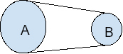

   Va=Vb 	 Ra>Rb  	Ta>Tb 

   ` `fa<fb 	 ωa<ωb 	 aca<acb

1. per axis (only gears)

   Va>Vb 	 Ra>Rb 	 Ta=Tb

   ` 	 `fa=fb	  ωa=ωb  

   Ra\*na=Rb\*nb, where n is numb of teeths

1. fix pulley

   force made has direction opposite to the direction of movement of the object

   the force required to lift the object does not change

1. movel pulley

   force made has same direction as the direction of movement of the object

   the force required to lift the object is halved

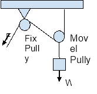

1. ## Dynamics
studies how a physical system might develop or alter over time and the cause of those changes, that is,the forces and theirs effects on motion

an inertial frame of reference is a coordinate system for which Newton's First Law applies

*“**Forces** (N) is the ability to cause a mass to accelerate.*

***Mass** (kg) is a measure of the body’s inertia, that is, the tendency of a body to remain in its current state of static or dynamic equilibrium” - Newton Definition*

*1N = 1 kg\*m/s²*

1. Newton’s Law of Motion

*1st law:* Law of Inertia

states that if a body is at rest or moving at a cst speed in a straight line, it will remain at rest or keep moving in the same way unless it is acted upon by a force

when bigger the mass, more force is need to move the object

*P→=m\*v→*

*2nd law:* Fundamental Principle of Dynamics

states that the time range of change of the momentum of a body is equal in both magnitude and direction to the force imposed on it

a force applied to a body can change the magnitude, direction or both of the momentum

F→=m\*a→

1. Net Force

be F1→ and F2→  and θ angle between them

θ=0: Fn→=F1→+F2→

θ=180: Fn→=F1→-F2→

θ=90: Fn→=F1→2+F2→2

θ any value: Fn→=F1→2+F2→2+2\*F1→\*F2→\*cos(θ)

1. Contact Forces

1. Centripetal Force

   is the force responsible for keeping bodies attached to the circular path

   Fc→=m\*ac→=m\*v→R

1. Frictional Force

   is the force exerted by a surface as an object moves across it or makes an effort to move across it

   can be kinetic (contact between two moving bodies - convert kinetic energy into heat), sliding (stop the body which ir moving) and static (keep the body in rest)

   Drag Resistance is a special type, acts on objects traveling through air/water

   Ffric→=μ\*Fnorm→

, where μ coeff of frictions

1. Tension Force

   is the force that is transmitted through a string, rope, cable or wire when it is pulled tight by forces acting from opposite ends

   work along the length of the wire and pulls the energy equally from both ends

   Ftens→=m\*a→

1. Normal Force

   is the support force exerted upon an object that is in contact with another stable object, always perpendicular

   Fnorm→=m\*g→

1. Spring Force

   is the force exerted by a compressed or stretched spring upon any objects that is attached to it

   Fspring→=k\*x

, where k is a spring cst

x is the distance stretched/compressed

1. Action-at-a-Distance Force
   1. Gravitational Force

      it is acts between massively large objects (like planets) and other objects, drawing clone to the first

   1. Electrical Force

      it is acts between two charged bodies

   1. Magnetic Force

      it is acts between iron and magnet

*3rd law:* Law of Action and Reaction

states that when two bodies interact, they apply forces to one another that are equal in magnitude and opposite direction

F1,2→ = -F2,1→

1. Universal Gravitation

studies the motion of celestial bodies

1. Laws of Uni. Grav.

   G (Universal Gravitational Cst) = 6.67408\*10-11Nm²kg²

   d is the distance to the body center and M/m is the body mass

F→=G\*M1\*m2d²

*Body Weight  W→=m\*g*

*Gravity of a celestial body g=G\*Md²*

1. Kepler’s Laws

are the laws of planetary motion

1. 1st - Law of Orbits

   the orbit of the planets is an ellipse in which the sun occupies one of the foci

1. 2nd - Law of Areas

   the speed with which the areas are scanned is equal, that is, the areolar speed of the orbit is cst

1. 3rd - Law of Periods

   `	`this cst is the same for all planets from a predetermined star

   T2R3=cst=4\*π2G\*M     

   `                                        `, where R=Rmax-Rmin2

1. Energy
   1. Type of Work (J - Joule)

τ>0 if F→ help the motion

τ<0 if F→ doesn't help the motion

τ=F→\*ΔS\*cos(θ)

*‘variable force’* is the are of the graphic between F and ΔS

τ=null if  F→=0  or  ΔS=0  or  θ=90*°*

if θ=0⇒τ=F→\*ΔS 

angle 90<θ<180 create resistance

1. Mechanical

Em=Ek+Ep

1. Kinetic

Ek=m\*v²2

1. Potential

Ep=m\*g\*h  gravitacional

Ep=k\*x²2  elastic

1. Power

   amount of energy transferred per unit of time

P=F→\*Vm\*cos(θ)

Pave=τΔt
1. ## Statics
studies physical systems that do not experience an acceleration (a=0), but rather, are in static equilibrium with their environment (F=0)

assume three conditions: (1) the body is perfect rigid; (2) all forces acting on the body at rest has to be zero; (3) there must be no tendency for the forces to turn the body about any axis

1. Material Point Balance

material point is every body whose dimensions are not important

in static it is a sufficiently small body where we assume that all the forces acting on it cross at the same point

ΣF→=0

1. Equilibrium of Rigid Body

the dimensions of the bodies cannot be ignored

forces don’t intersect at the same point

there is a tendency to spin: M=±F→\*d  *Moment of Force*

`						        `*‘torque’*

ΣF→=ΣM=0

1. Newton’s Lever

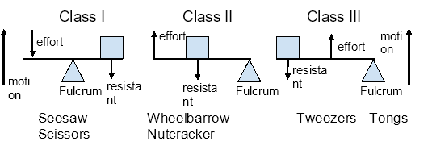

F1→\*d1=F2→\*d2

F1→: effort force

F2→: resistance force

d1: ΔS between effort and fulcrum

d2: ΔS between resistance and fulcrum

F1→\*d1 is the 'torque'

1. # **Fluid Mechanics**
concerned with the mechanics of fluids and the forces on them

**Perfect Fluid** is defined as that fluid which at rest enjoys the property of isotropy, that is, around a point the forces are equal in all directions. They are fluids without viscosity, density is cst and there is an isotropic state of stress under conditions of motion. They don’t exist in nature.

**Shear Stresses** is the distribution by units of area of a force acting parallel to a given surface. In fluids, create a behavior known as flow ( a continuous deformation).

The fluids that obey the proportionality equation, that is, a linear relationship between the value of the applied shear stress and the resulting deformation velocity (cst μ) are the **Newtonian Fluids** (i. g., water). Fluids that don’t follow the equation are **Non-Newtonian Fluids** (i. g., sedge).

## Concepts
**Density** ρ (ró) relationship between mass and volume of a material at a given pressure and temperature.

ρ=mv

**Pressure (Pa)** measures the force applied perpendicularly to a surface.

` `*Earth Atmosphere Pressure = 10⁵ N/m²*

`     `Pe ↓ as climbs upward and Pe ↑ as dive in the lake

P=FA

**Specific** **Weight** γ (gamma) the weight of the volumetric unit.

γ=ρ\*g 	                γ=WV for liquids 

γ=PR\*T for gasses

**Compressibility** is the ability of a body or substance to reduce its volume when it is subjected to pressures in all its parts.

εvol=-V\*ΔPΔV

**Elasticity** is the property of fluid to increase its volume when pressure is reduced.

E=-V\*ΔPΔV

**Capillarity** is the tendency for substance to move up or down the walls of thin tubes or to move in porous materials (napkins, sponges). There are two different forces: Adhesion (attraction of liquids molecules with solids) pulls the liquid molecules closer together than through cohesion pulls the others. Stop when cohesion > adhesion. Works against gravity.

**Surface Tension** is the property of the surface layer exerting tension and is the force required to maintain the unit length of the film in equilibrium.

**Streamline** is the curve whose direction at each point is tangent to the velocity vector of the fluid, thus, it’s possible to visualize the behavior of the fluid during the motion.

**Stationaring (laminar)** flow is obtained when the flow velocity is small, that is, cst flow velocity at all points. *Re<2100-2300.*    Re=ρ\*V\*Dμ where D is the pipe diameter 

**Non-Stationaring (turbulent)** is when the fluid velocity varies over time. Re>4000.

**Viscosity** μ is the resistance that a fluid offers to flow. It can be defined as the internal friction resulting from the movement of one layer of fluid in relation to another one; is who determines the degree of resistance of the fluid to the shear force, that is, to resist deformation.

**Flow** **Rate** measures the amount of fluid that flows inside a given tube of well-defined cross-sectional area.

Q=ΔVΔt

**Masss Discharge** is defined as the amount of mass that passes through the control surface in the unit of time.

Dm=ΔmΔt

**Pressure Velocity/Dynamic** happens when the liquid passes through a point with different areas. Causes hydrostatic pressure to decrease in regions where flow velocity is increased, so kinetic energy (dynamic pressure) must increase at the expense of hydrostatic pressure energy.

## General Equation of Perfect Gas
perfect gasses or ideal gasses, is a gas which increase proportionately the temperature and kinetic energy

they obey a particular idealized relationship between pressure, velocity and temperature, called the general law (contains Boyle’s and Charles’ law)

don’t exist in nature - for real gas, only under high temp and low pressure

P\*V=n\*R\*T

`  `R is the universal gas cst R=8.314510 Nm/molK 

n is the number of moles → n=m(total mass)M(molecular mass of gas)

Same mass of gas and in different conditions

P1\*V1T1=P2\*V2T2=n\*R=cst

P1\*V1n\*T1=P2\*V2n\*T2=R→Vn=1γ

P1γ\*T1=P2γ\*T2=R=cst

Transformation

*Isobaric: cst pressure*  V1T1=V2T2

*Isothermal: cst temperature*  V1\*P1=V2\*P2

*Isometric: cst volume*  P1T1=P2T2

##
1. ## Hydrostatics
studies fluids at rest in stable equilibrium

1. Pascal’s Principle

says that the increase of pressure exerted at any point within an ideal liquid in equilibrium is transmitted integrally to all point contained in the liquid and to the walls

P1=P2⇒F1A1=F2A2

1. Archimedes’ Principle

says that every body fully immersed or partially in any liquid is subjected to a vertical force (called **buoyant force**) from bottom to top, equal to the weight of the portion of the liquid displaced by the body and applied to the point where it was located the center of mass of this portion of fluid

bigger fluid ρ → bigger buoyant force

Fb=ρliq\*V\*g=γliq\*V

γliq>γsol⇒W<FB  -body floats 

γliq=γsol⇒W=FB  -body immersed in equilibrium 

γliq<γsol⇒W>FB  - body sinks

Float Bodies Equilibrium

**Carena Center (C)** is the center of gravity of the submerged part of the body and is the point of application of thrust

**Metacenter (M)** point around which the kiel center rotates

**Metacentric Height (MH)** is the distance between M and CG (center of gravity) - MH = M-CG

*Stable* *Equilibrium*  ⇒  M>C→MH>0

*Unstable* *Equilibrium*  ⇒  M<C→MH<0

*Indifferent* *Equilibrium*  ⇒  M=C→MH=0

1. Stevin’s Principle

states that points situated at the same level within a liquid in static equilibrium support the same pressure

P1=P2=P3

1. Fluid/Statics Pressure

is the pressure exerted by a fluid at rest due to the force of gravity

Pf=ρ\*g\*h=γ\*h 

, where h is the fluid high

1. Hydrostatic Force

are the resultant force caused by the pressure load of a liquid acting on submerged surfaces

FH=Pf\*A

1. ## Hydrodynamics
studies the effect of forces on fluid motion

when analyzing the movement of fluids, it’s necessary to observe their characteristic of pressure, velocity, temperature and density

and also the container theys store them, such as area, height and shape

1. Continuity Equation

say that, although any pipe doesn’t have the same cross-sectional area along its length, the flow rate (discharge mass) along its entire length is the same.

That is, the points where the cross-sectional area is smaller, the velocity will be bigger. This increase is due to the pressure velocity, which is generated by the pressure difference between the bigger and smaller area.

Dm=ΔmΔt=ρ\*ΔVΔt=ρ\*S\*ΔxΔt=ρ\*S\*v

⇒ S1\*v1=S2\*v2  ⇒ D1=D2  and  Q1=Q2

1. Bernoulli’s Principle

Establishes that the energy, in a steady flow, is constant along the path described by the fluid and can be deduced from the kinetic energy theorem.

*“The work of the resultant of the forces acting on a body between two instants is equal to the change in kinetic energy experienced by the body in that time interval.”*

τnet=P1\*S1\*Δx1-P2\*S2\*Δx2-m\*g\*(h2-h1)

` `F1→\*τ	   F2→\*τ  	         W\*τ

First ‘-’ is because F1 and Dm has opposite directions

Second ‘-’ is because F2 and Dm has opposite directions

from  S1\*Δx1=S2\*Δx2  and  the Kinetic Energy Theorem:

τnet=(P1-P2)\*mρ-m\*g\*(h2-h1)  and  τnet=ΔEk   

so:  (P1-P2)\*mρ-m\*g\*(h2-h1)=m\*v222-m\*v122

P1+ρ\*v122+ρ\*g\*h1=P2+ρ\*v222+ρ\*g\*h2

simplifying:

P+ρ\*v22+ρ\*g\*h=cst

,  where  P and ρ\*g\*h is the Static Pressure

`         `ρ\*v22 is the Dynamic Pressure

1. # **Thermal Physics**
studies heat and its effect on matter

is the study of the statistical nature of physical systems from a energy perspective

in **adiabatic transf.** there is no heat exchange - it is isolated from the environment, the energy required comes from work

## Temperature
is the measure of the degree of agitation of the particles that make up a body

is directly proportional to the speed at which its atoms and molecules vibrate, rotate or translate

## Heat
is the thermal energy transferred between bodies that are at different temperatures, being a form of energy

always transitions from the body of higher temperature to bodies of lower temp, until thermal equilibrium is established

measure in calorie (cal) - *Calorimetry* - 1 cal rise, by 1ºC, 1g of water

**specific heat (c)** is the amount of heat required for 1g of the substance to undergo a temp change of 1ºC.   c=Qm\*ΔT=Cm

**heat capacity (C)** is the amount of heat supplied to a body by the change in temp suffered by it.   C=QΔT

Heat Spreader

**Conduction:** heat transfer through contact with surfaces.

**Convection:** heat transfer due to the formation of convection currents (≠ density) in a fluid.

**Irradiation:** transmission of heat by electromagnetic waves.

Heat Forms

**Sensible Heat** responsible for the change in temperature in a body. If received, T increases; when given it away, T decreases.

` `Q=m\*c\*ΔT , where Q is the sensible heat

**Latent Heat** is the amount of heat that must be transferred for a body or substance to change its physical state. There are no temperature changes when a body exchanges latent heat, only change in physical state. Therefore, we say that it receives latent heat.

` `Q=L\*m , where L is the latent heat and Q is

`							`the total of heat to change phase
##
##
##
##

## Thermal Expansion
occurs when a body receives or gives off large amounts of heat

in addition to the changes in temp or its states of aggregation (physical state), the passage of heat to a body can cause changes in its dimensions

it’s depends on its expansion coefficient

Types

*Linear:*   change the length 		α: Linear Exp. Coeff.

`		`L=L0+L0\*α\*ΔT   ⇒  ΔL=L0\*α\*ΔT

*Superficial:*  change the area 		β: Superficial Exp. Coeff.

`		`S=S0+S0\*β\*ΔT    ⇒  ΔS=S0\*β\*ΔT

*Volumetric:*   change the volume 	γ: Volume Exp. Coeff.

`		`V=V0+V0\*γ\*ΔT   ⇒  ΔV=V0\*γ\*ΔT

## Internal Energy (U)
all substance have, which is the sum of the kinetic energy (related to temperature - will increase during the phases) and potential energy (related to phases - will increase during phase change) of its constituent molecules

the average distance between molecules increases during the phases changes, this increase their Electrostatic Potential Energy

1. ## Thermodynamics
studies the relationships between heat, work, temperature and other quantities, such as pressure, volume, etc.

it is responsible for the establishment of laws that govern all the transformations that can be suffered by matter.

1. ### Laws of Thermodynamics

**Law zero**: it is the law of thermal equilibrium. 

This law says that all bodies tend to exchange heat until they reach thermal equilibrium.

**First law**: it is the law of conservation of energy. 

This law states that all the heat (Q) received by a system during a thermodynamic process can be converted into work (τ) or an increase in its internal energy (ΔU). 

**Q = τ + ΔU**

\1) regarding heat (Q):

Q > 0, the system receives heat.

Q < 0, the system loses heat.

C = 0, the system does not receive or give heat.

\2) regarding work (τ):

τ > 0, the volume is expanded.

τ < 0, the volume is reduced.

τ = 0, the volume is constant.

\3) regarding the variation of internal energy (ΔU):

ΔU > 0, there is an increase in temperature.

ΔU < 0, there is a decrease in temperature.

ΔU =0, the temperature is constant.

**Second law:** it is the law of entropy (S).

*“Heat cannot flow spontaneously from a lower temperature body to a higher temperature body.”* - Clausius

*“It is impossible to build a machine which, operating in a thermodynamic cycle, converts the entire amount of heat received into work.”* - Kelvin-Planck

Entropy (S) is the degree of disorder or uncertainty in a system. So, if an amount of heat Q flows into a heat reservoir at constant temperature T, so its entropy S increases by 

**ΔS = Q/T**

Entropy never decreases, remaining constant for reversible processes, or increasing for irreversible processes.

Let's say that there are two heat reservoirs R1 and R2 at temperatures T1 and T2. If an amount of heat Q flows from R1 to R2, then the net entropy change for the two reservoirs is:

**ΔS = Q/T2 - Q/T1**

**Heat Engine**

System capable of doing work in a cyclic fashion.

Absorbs heat Q1 from R1 and exhausts heat Q2 to R2 for each complete cycle. 

Then, by conservation of energy, the work done per cycle is             W = τ = Q1 − Q2, and the net entropy change for the two reservoirs is       ΔS = Q/T2 - Q/T1.

*Max efficiency of the engine*

**nmax = 1 - (Q2/Q1)min = 1 - (T2/T1)**

**n = τ/Q1**

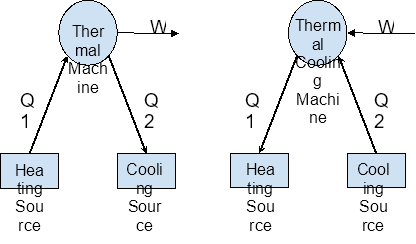

**Third law:** it is the law of absolute zero. 

*“The entropy of the system tends to zero if its temperature approaches zero.”* - Nernst  

This law tells us that at 0K, the internal energy of the body is zero, without molecular motion. If Q = τ - 100% yield, no loss. Absolute zero has never been reached in the laboratory.

**Q = ΔU + τ** 

1. # **Waveform**
A wave is an oscillation that travels through space.

Wave motion transfers energy from one point to another, with little or no associated mass transport.

Consists of oscillations or vibrations around almost fixed locations.

Is confined in some finite region of space, called its **domain.**

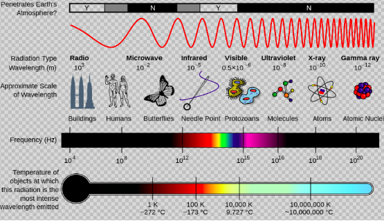

1. ## Types of waves
**Mechanical waves:** require a medium to propagate, local deformation in some medium that propagates from particle to particle by creating local stresses that cause strain in neighboring particles too. *- sound waves*

**Electromagnetic waves:** do not require a medium to propagate, instead, they consist of periodic oscillations in electrical and magnetic fields generated by charged particles. Can travel through a vacuum. *- light*

**Gravitational Waves** disturbances in spacetime, **Heat diffusion, plasma waves** combina mechanical deformations and electromagnetics fields, **reaction-diffusion waves.**

**OBS:** Electromagnetic and Mechanical Waves transfer energy, momentum and information - not particles.

1. ## Concepts
The distance between successive **crests** or **troughs** is called wavelength. 

The height of a wave is the **amplitude**. 

How many crests or troughs pass a specific point during a unit of time is called the **frequency**. 

The **velocity** of a wave can be expressed as the wavelength multiplied by the frequency.

**Transverse:** the field disturbance at each point is described by a vector perpendicular to the direction of propagation, also the direction of energy transfer *- radiation*

**Longitudinal:** the field disturbance at each point is described by a vector is exactly to the direction of propagation *- sound*

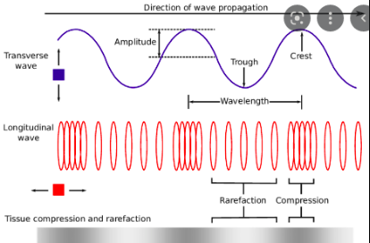

1. ## Wave behavior
In **reflection**, a wave encounters an obstacle and is reflected back, the angle of reflection and incidence are equal. 

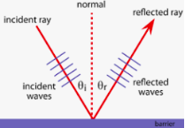

In **refraction**, a wave bends when it enters a medium through which it has a different speed (depending on the medium).

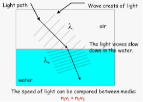 

In **diffraction**, waves bend when they pass around small obstacles (compared with the wavelength) and spread out when they pass through small openings. 

In **interference**, when two waves meet, they can interfere **constructively**, creating a wave with larger amplitude than the original waves, or **destructively**, creating a wave with a smaller (or even zero) amplitude.

1. ## Doppler Effect

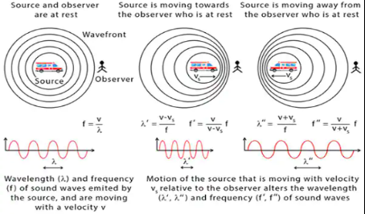

1. # **Optics**
studies electromagnetic radiation (light and infrared radiation), its interactions with matter, and instruments that use or detect it.

includes the study of sight.

Light Spectrum

Is the many different wavelengths of energy produced by a light source, measured in nanometers (nm). 

Each nanometer represents a wavelength of light or band of light energy.

**Light speed:** 299.792.458 or 3\*10⁸ m/s or 3\*10⁵

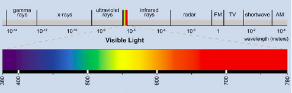

1. ## Physical/Wave optics
studies interference, diffraction, polarization, and other phenomena for which the ray approximation of geometric optics is not valid

1. ## Geometrical optics
Has to do with the principles that govern the image-forming properties of lenses, mirrors, and other devices that make use of light.

It is sometimes more convenient to regard an image as being composed of overlapping patterns of varying frequencies and contrasts.

An **optical image** is a reproduction of an object by a lens or mirror system, employing light as a carrier. 

An **entire image** is generally produced simultaneously, as by the lens in a camera, but images may also be generated sequentially by point-by-point scanning, as in a television system.

A **real image** is formed outside the system, where the emerging rays actually cross (can be caught on a screen or piece of film).

A **virtual image** is formed inside an instrument at the point where diverging rays would cross if they were extended backward into the instrument (can be caught in a microscope or telescope - see looking into the eyepiece).

A **paraxial ray** is a ray that makes a small angle with the optical axis of the system throughout its entire path. At any point in the optical system, we will have a small angle of the ray in relation to the optical axis.

1. ### Reflection
Use of polished mirrors for reflecting light 

*Concave mirrors* forms a real image of distant objects (telescopes)

*Convex mirrors* forms a virtual image of distant objects

*Plane mirrors* forms a virtual image of near objects

The angle of reflection is equal to the angle of incidence - angle between the normal and the ray.

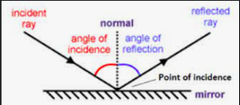

1. ### Refraction
Ray of light is sharply bent or refracted when passing one medium to another.

Based on the fact that light travels slowly in denser medium.

The ratio between the velocity of light in air to its velocity in the medium is called **refractive index** (n) of the medium for light of a particular color or wavelength.

In the light spectrum, closer to blue, higher n, closer to red, lower n.

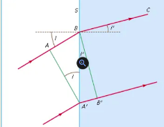

n'n = AB/BA'A'B'/BA' = sin Isin I'  ⇒  n'\*sin I' = n\*sin I

I is angle of incidence and I' is angle of refraction

When the incident angle is equal to the **critical angle** (in water-air surface is 48.5º), the reflected angle will be 90º, if it’s greater than the critical one, it will be a total internal reflection.

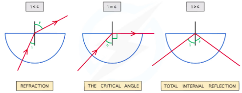

1. ### Dispersion
Measure the ability of a substance to disperse light.

The difference between the refractive indices of a transparent material for a specific blue, called F with wavelength of 4861 Å (angstrom = 10-8cm), and  a specific red, called C with wavelength of 6563 Å,  light.

Also compare with some intermediate color, like sodium “D” (5893 Å).

Dispersive power: 

ω = nF - nCnD - 1 

1. ### Mirrors
are polished surfaces that reflect light.

**Flat mirrors** 

A flat polished surface (forms virtual images). 

Are enantiomorphic, virtual images rotated 180º horizontally. 

Associated (two or more), with ⍺ angle, will form N virtual images 

N = 360α-1

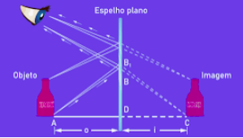

**Spherical mirrors**

A spherical cap with a polished surface. 

They can be concave or convex: 

*in concave* the reflective face is the inner one, 

*in convex* the reflective face is the outer one.

**Radius of curvature (R):** consists of the radius of the spherical surface that originated the cap, that is, the mirror itself.

**Center of curvature (C):** is the center of the original sphere.

**Vertex (V):** is the hub of the cap.

**Main Focus (F):** point to which rays parallel to the main axis are reflected

**Focal length (f):** is the distance from the vertex to the main focus and is approximately half the radius of curvature.

**Principal Axis:** he line passing through the center of curvature and the vertex.

**Secondary axes:** are lines perpendicular to the mirror surface that pass through the center of curvature.

Particular Rays

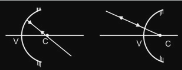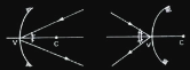

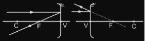

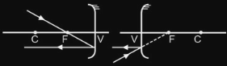

Concave Mirrors Rays

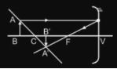

Object before Center of Curvature

*Image Real, Inverted and Smaller*

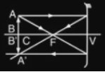

Object in Center of Curvature

*Image Real, Inverted and Same Size*

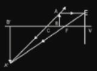

Object between Center and Focus

*Image Real, Inverted, Bigger*

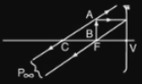

Object over Focus

*Image Improper - form in the infinitive*

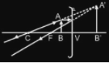

Object between Focus and Vertex

*Image Virtual, Equal, Bigger*

Convex Mirrors Rays

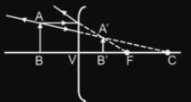

*Image Virtual, Equal, Smaller*
###
###
###
1. ### Lens
is a transparent optical system that has two surfaces (at least one curve)

is used to change the apparent dimensions of an object.

**Converging lens**

focuses the light beam

the focus is real

similar to concave mirrors Three types: 

biconvex

plano-convex

concave-convex

**Diverging lens** 

scatters incident rays

similar to convex mirrors

Three types: 

biconcave

plano-concave

convex-concave

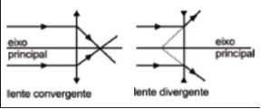

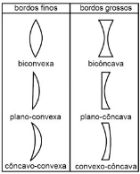

Thin edges lens: 

with nLens > nSurrounding will converge

with nLens < nSurrounding will diverge		

Thick edges lens: 			*n is reflection idx*	

with nLens > nSurrounding will diverge

with nLens < nSurrounding will converge

Particular Rays

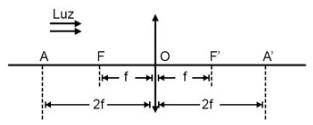

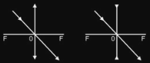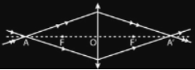

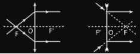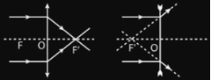

Diverging Lens Rays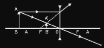

*Image Virtual, Equal, Smaller*

Converging Lens Rays

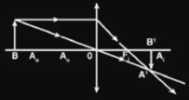

Object before anti principal point (A)

*Image Real, Inverted, Smaller*

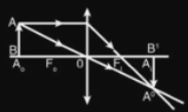

Object over anti principal point (A)

*Image Real, Inverted, Same Size*

Object between anti principal point and Focus

*Image Real, Inverted, Bigger*

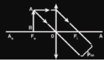

Object over Focus

*Improper Image*

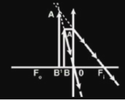

Object between Focus and Center

*Image Virtual, Equal, Bigger*

Degrees

The light bending ability of a lens is measured by the **vergence** **(V)**, commonly called the degree.

unit of measurement is the diopter (di), where 1 di = 1 m-1

V=1F

1. # **Electricity & Magnetism**
**Electricity** is the *flow of electric charge*, that is, the result of the accumulation or motion of numbers of particles *- like electrons and ions*. Is also referred to as an **energy carrier**, it can be converted to other forms *- such as mechanical energy or heat*. 

**Magnetism**,** caused by the *motion of electric charges,* is the *force exerted by magnets* when they *attract or repel* each other.

1. ## Electricity
The one we use is a *secondary energy source* because it is produced by converting primary sources of energy *- such as coal, natural gas, nuclear energy, solar energy, and wind energy -* into electrical power. 

Primary energy sources are **renewable** *- can replenish itself at the rate it is used -* or **nonrenewable** energy *- has a limited supply*.

The outermost electrons of an atom are called the **valence electrons**, these require the least amount of force to be freed from an atom. Using enough *electrostatic force* on the valence electron, we can eject the electron from orbit around the atom creating a free electron.

As our **free electrons** are floating in a space between atoms. In this chaos the free electron eventually finds a new atom to latch on to; in doing so, the negative charge of that electron ejects another valence electron from the atom. Now a new electron is drifting through free space looking to do the same thing. This chain effect can continue on and on to create a flow of electrons called electric current.

**Current electricity** exists when charges *- usually an electron  -* are able to constantly flow, the intensity of which is usually measured in amperes *(A)*.

To do that, a *circuit* is required, which is a closed, never-ending loop of conductive material - a mix of wires and other components to control the flow.

Can't have any *insulating gaps*.

**Direct current** *(DC)*** is a one-directional flow of electric charge. **Alternating current** *(AC)*** will, periodically, reverse the direction and change its magnitude continuously with time. 

Ver para ver se entendeu https://www.youtube.com/watch?v=Wm75XgbqHBY

An element's **conductivity** measures how tightly bound an electron is to an atom, with *high conductivity* are called **conductors** *- good to create an electron flow, such as metals (copper, silver, and gold)*. Elements with *low conductivity* are called **insulators** *- good to prevent the flow of electrons, such as glass, rubber, plastic, and air.*

**Charge** *(Q)* is a property of matter *- such as mass, vol -* that can be *positive (+)* or *negative (-)* and is determined by the electrons *negative*, prótons *positive* e neutrons *neutral*. Electrons carries approximately -1.6022\*10-19 Coulombs and protons carries +1.6022\*10-19 C.

**Electric Power** is the rate at electrical energy is transferred by an electric circuit P=QVΔt.

**Electric fields** describe the *pulling* or *pushing* *force* in a space between charges. Its *direction* is always defined as the direction a positive ‘test charge’ *- is infinitely small -* would move if it was dropped in the field.

It’s magnitude is calculated by: E=kQd²=Fq N.

For a **single negative charge** we draw our electric field arrows *pointing* *inward* at all directions. For a **single positive charge** we draw arrows *going out* of the positive charge.

A **uniform field** points from positive to negative charges. The *flow of electrons* flows in **directions opposite** to the** electric fields.

1. ## Magnetism
Substances are made of atoms. Inside them, the electrons circle *- spinning -* the nucleus, which generates an electric current and causes each electron to act like a magnet. 

If equal numbers of electrons spin in opposite directions will cancel their magnetism, if the most spin in the same direction make the atom strongly magnetic. The *spin direction* will determine the magnetic field direction.

**Magnetic field**, a vector field in the neighborhood of a magnet, electric current or changing electric fields, in which magnetic forces are observable. Its source are dipoles, meaning that they have a **N**orth and **S**outh pole - **N**&**S** *attract* and **N**&**N** or **S**&**S** *repel*. 

So, the direction of the field propagates outward from the north pole and enters through the south pole. Its lines never cross each other and always make closed loops. The density of the lines indicates the strength of the field.

The strength is a vector **H** and is defined as H=Bμ-M, where **B** is the magnetic flux density - *measure the magnetic force acting per unit current per unit length*; **μ** is the magnetic permeability *- measure a material's resistance to the magnetic field or the degree to which magnetic field can penetrate through a material*; **M** is the magnetization *- measures the density of permanent or induced dipole moment in a given magnetic material*. In vacuum, there is no magnetization. Is measured in tesla **T**, which is defined in terms of how much force is applied to moving a charge due to the field.

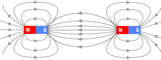

**Magnetic Flux** refers to the amount of magnetic field lines that cross an area - measure in Webers *(Wb --- 1 Wb=1 T/m²)*. It relates the strength of the magnetic field to the area and the angle between the magnetic field lines and the normal line of the area.

Φ=B\*A\*cosθ, where θ is the angle between B and the normal of area A  &&  B the magnetic field

The movement of molten metal in the Earth’s outer core generates electric currents, which creates a magnetic field in Earth. The geomagnetic poles often move, due to activity far beneath the Earth’s surface. 

The shifting locations of the geomagnetic poles are recorded in rocks that form when molten material - magma - wells up through the Earth’s crust and pours out as lava. As lava cools and becomes solid rock, strongly magnetic particles within the rock become magnetized by the Earth’s magnetic field. The particles line up along the lines of force in the Earth’s field. In this way, rocks lock in a record of the position of the Earth’s geomagnetic poles at that time.

1. ## Electrical Network - Circuits
Is an interconnection of **electrical components** *(e.g., batteries, resistors, inductors, capacitors, switches, transistors)* or a model of such an interconnection, consisting of **electrical elements** *(e.g., voltage sources, current sources, resistances, inductances, capacitances)*.

An **active network** contains *at least one voltage/current source* to supply energy. A **passive network** *does not* contain *an active source*. It’ll be **linear** if its signals obey the *principle of superposition*, *otherwise* it is **non-linear**. 

The *stored energy* of a circuit is called **electric potential energy**, positive charges in an electric field have. When set into motion by an *electrostatic force*, that energy can become *kinetic*, and the charge can do *work*.

Electrical Components

A **battery** is a source of electric power consisting of one or more electrochemical cells with external connections for powering electrical devices.

A **generator** is a device that converts motive power *(mechanical energy)* into electric power.

Others **source power:** fuel cell *- an electrochemical generator*, photovoltaic device *- from light* and thermoelectric *- from temperature gradients*.

**Resistor** is a passive two-terminal that implements electrical resistance, to reduce current flow, adjust signal levels, and others. 

In series resistors, it's: Req=R1+ ... +Rn

In parallel resistors, it's: 1Req=1R1+ ... +1Rn

Power Dissipation: P=IV=I²R=V²R

A **diode** is a two-terminal electronic component that conducts current primarily in one direction (asymmetric conductance); it has low (ideally zero) resistance in one direction, and high (ideally infinite) resistance in the other.

An **inductor** is a passive two-terminal that stores energy in a magnetic field when electric current flows through it. Typically consists of an insulated wire wound into a coil.

A **capacitor** is a passive two-terminal that stores electrical energy.

**Switch** is an electrical component that can disconnect or connect the conducting path in an electrical circuit, interrupting the electric current or diverting it from one conductor to another.

A **transistor** is a semiconductor device used to amplify or switch electrical signals and power.

**Transducers** generate physical effects when driven by an electrical signal, or vice versa. **Sensors** are transducers that react to environmental conditions by changing their electrical properties or generating an electrical signal.

Electrical Elements

A voltage source is a two-terminal device which can maintain a fixed voltage. An ideal voltage source can maintain the fixed voltage independent of the load resistance or the output current. However, a real-world voltage source cannot supply unlimited current.

A current source is an electronic circuit that delivers or absorbs an electric current which is independent of the voltage across it.

The **electrical** **resistance** *- measure in Ω -* of an object is a measure of its opposition to the flow of electric current - R=VI. Its reciprocal quantity is **electrical** **conductance** *- measure in Siemens (S)*, measuring the ease with which an electric current passes - G=IV=1R. 

**Inductance** is the tendency of an electrical conductor to oppose a change in the electric current flowing through it.

**Capacitance** is the ratio of the amount of electric charge stored on a conductor to a difference in electric potential. There are two closely related notions of capacitance: *self capacitance* and *mutual capacitance*.

1. ## Electrostatics
Deals with the phenomena and properties of stationary or slow-moving electric charges. These phenomena arise from the forces that electric charges exert on each other and are described by Coulomb’s Law.

**Static electricity** exists when there is a build-up of opposite charges on objects separated by an insulator. Will exists until the opposite charges find a path between each other to balance the system out, which creates a static discharge - like lightning. The force is measured using Coulomb's Law.

**Coulomb's Law** calculates the *magnitude* of the *electrostatic force* that operates between charges. *Opposites* charges *attract* each other, and *like* charges *repel* each other. The *amount of force* depends on how far they are from each other, the closer two charges get, the greater the force *- either pushing together, or pulling away -* becomes.

F=kQ1Q2r2, where K is the Coulomb's Cst equal to 8.99\*109 Nm2/C2

**Electric potential difference or tension** is related to the work done by an external force when it transports a charge slowly from one position to another in an environment containing other charges at rest.

U=VA-VB=TABq Volts*, where V =kQd is the potential / voltage in point A/B and   TAB is the work to move from A to B*.

U=R\*I, for ohmic resistor
1. ## Electrodynamics
It studies the dynamic aspect of electricity, that is, the constant movement of electrical charges.

**Electric current** is an orderly movement and is inserted into a conducting system, whose charges have a potential difference. Is measured by: I=ΔQ/Δt  A.

**Electrical resistance** makes it difficult for electric current to flow.

R=U / I, where U is the tension, I is the current and R the resistance Ω 

R=ρLA Ω, where ρ is the conductor resistivity and L/A the resistor length/area

The **volt-ampere** *(VA)* expresses the apparent power of a system, that is, the total power supplied by a given source.

**Electrical Power** is the amount of electrical energy consumed in a given period of time: Pot = U\*I=R\*I²=U²R Watt.

**Energy Consumption** is measure by: E=P\*Δt   kWh

The phenomenon **Joule Effect** *- used in heaters -* occurs when the electric current passes through an insulating material, we say that a dielectric breakdown has occurred and a large amount of heat is produced, because the crossing is expensive.Q=R\*I²\*Δt, where Q is the amount of energy converted into heat (J).

1. ## Electromagnetism
Deals with the electromagnetic force that occurs between electrically charged particles. It is based on the **Faraday Law**: *moving electric charges generate a magnetic field* and *changing magnetic flux produces an electric field*.

Following Faraday Law, when there is a variation/change of magnetic field flux in some conductive circuit, as in a coil, an induced **electromotive force** *(electrical voltage)* arises in that conductor. 

Uses negative when considering that the electric current that is induced always arises in order to oppose the variation of external magnetic flux.

ϵ=ΔΦΔt *Volts*

**Electromagnetic fields** are concentrations of electric and magnetic charges, which move like waves - they are called electromagnetic waves - light is one, propagate at the speed of light and are transverse waves. 

f=vλ, where f is frequency, and λ is wavelength

The **electromagnetic force** is a type of physical interaction that occurs between electrically charged particles and is the combination of all magnetic and electrical forces *- can be attractive or repulsive*. Also called Lorentz force: F=qE+qv×B.

**Ampere's law** states that *“The magnetic field created by an electric current is proportional to the size of that electric current with a constant of proportionality equal to the permeability of free space”*.

Ampere's circuital law can be written as the integral line of the magnetic field surrounding closed-loop equals the number of times the algebraic sum of currents passing through the loop 

H∙dL=Ienc

**Maxwell’s Equations** *- 19th century*, four equations that, together, form a complete description of the production and interrelation of electric and magnetic fields.

With equation 3 and 4 can explain electromagnetic wave propagation on its own.

Equation in both form: Derivative  ---  Integral

∘ is the dot product - n is the unit normal vector-S is the surface integral

ρ is the charge density - J is current density - E is the electric field

B is the magnetic field - D n H are field quantities proportional to E and B

div (divergence) and curl are operator from vector calculus

ε0 is electric permittivity of free space 8.854\*10-12

(1) First Equation

expression of the Gauss’s law for statics electric fields

the electric flux across any closed surface is proportional to the net electric charge enclosed by the surface - Φ=q/ε0

electric field produced by electric charge diverges from positive charge and converges upon negative charge

div E=ρ/ε0	---	S(E∘n)ds=q/ε0

(2) Second Equation

expression of the Gauss’s law for statics magnetic fields

there are no isolated magnetic poles *magnetic monopoles*, but the Coulomb force acts between the poles of a magnet

the divergence of the magnetic field at any point is zero

div B=0		---	S(B∘n)ds=0

(3) Third Equation

expression of the Faraday’s law, which says a changing magnetic field produces an electric field

electric fields are produced by changing magnetic fields that changes with time

curl E =-∂B∂t	---	CE∘dI=-ddtS(B∘n)ds

(4) Fourth Equation

expression of the Ampere’s law which says a changing electric field produces a magnetic field

circulating magnetic fields are produced by changing electric fields and by electric currents, Maxwell’s extension of Ampère’s law to include the interaction of changing fields

curl B=μ0( J+ε0∂E∂t)	---	CB∘dI=μ0[I+ε0ddtS(E∘n)ds]

1. ## Electrochemistry
Concerned with the relationship between electrical potential difference, as a measurable and quantitative phenomenon, and identifiable chemical change, with the potential difference as an outcome of a particular chemical change, or vice versa.

When a chemical reaction is driven by an electrical potential difference, as in electrolysis, or if a potential difference results from a chemical reaction as in a battery or fuel cell, it is called an electrochemical reaction. 

Unlike in other chemical reactions, in electrochemical reactions electrons are not transferred directly between atoms, ions, or molecules, but via the aforementioned electronically-conducting circuit. This phenomenon is what distinguishes an electrochemical reaction from a conventional chemical reaction.

1. …

1. # **Theory of Relativity**
They define a relationship between **space** and **time**, both being relative and not static. That is, *time* changes depending on the observer, according to three variables: *speed*, *gravity* and *space*.

1. ## Galilean Transformation
Is used to transform between the coordinates of two reference frames which differ only by constant relative motion within the constructs of Newtonian physics. 

The equations below are only physically valid in a Newtonian framework, and not applicable to coordinate systems moving relative to each other at speeds approaching the speed of light.

Formally express the ideas that space and time are absolute; that length, time, and mass are independent of the relative motion of the observer; and that the speed of light depends upon the relative motion of the observer *- wrong*.

The transformations embody the intuitive notion of addition and subtraction of velocities as vectors.

The notation below describes the relationship under the transformation between the coordinates (x, y, z, t) and (x′, y′, z′, t′) of a single arbitrary event, measured in two coordinate systems S and S′, in uniform relative motion (velocity v) in their common x and x′ directions, with their spatial origins coinciding at time t = t′ = 0:

*x' = x - v\*t    ||    y' = y    ||    z' = z    ||    t' = t*

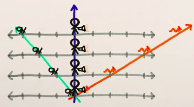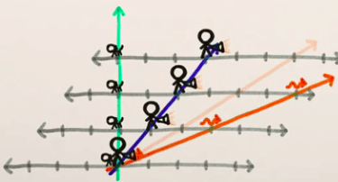

*Example of Galilean Transform. of a Human (white line) and a Cat (green line) which is walking in axis x - Orange line is the light*

*Vertical line is the Time   ---   Horizontal line is the X Space   ---   only X change*

This transformation was not compatible with electromagnetism and does not keep the speed of light constant, although it explains everyday experiences very well.

1. ## Lorentz Transformation
They describe how, according to special relativity, the measurements of space and time of two observers change in each frame of reference.

They reflect the fact that observers moving at different speeds measure different values of distance, time and, in some cases, the ordering of events.

For very small velocities (v << c), the Galileo transformations can be used as an excellent approximation *- gamma value is close to 1*.

Formally express the relativity ideas that space and time are not absolute; that length, time, and mass depend on the relative motion of the observer; and that the speed of light in a vacuum is constant and independent of the motion of the observer or the source.

If we want a transformation that keeps the speed of light constant for ALL frames of reference, both space and time cannot remain constant for frame changes.

The notation below describes the relationship under the transformation between the coordinates (x, y, z, t) and (x′, y′, z′, t′) of a single arbitrary event, measured in two coordinate systems S and S′, in uniform relative motion (velocity v) in their common x and x′ directions, with their spatial origins coinciding at time t = t′ = 0:

*x' =* γ*( x - v\*t )    ||    y' = y    ||    z' = z    ||    t' =* γ*( t - vxc²)  --*  γ=1/1-vc²

*Detail: if the speed v = c, it would reach an indeterminacy 1/0, so, it is impossible for the event to travel at the speed of light.*

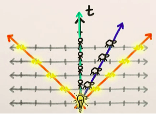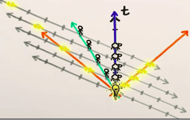

*Example of Galilean Transform. of a Human (green line) and a Cat (white line) which is walking in axis x - Orange line is the light*

*Vertical line is the Time   ---   Horizontal line is the X Space   ---   both change*

1. ## Special Relativity
Generalizes *Electromagnetism* and *Newtonian Physics* into one theory.

Stick only to systems in which **gravitational fields** are **not** taken into account.

It states that **space** and **time** are **subjective quantities,** *a unified geometric entity - 4D*, for when there is velocity close to the light.

Time and space are no longer invariant when changing the reference system, becoming dependent on the *observer's state of movement* *- simultaneity is relative*.

**Ex:** two events that occur simultaneously in different places of the same reference system can occur at different times in another reference system *- observer*.

The **temporal intervals** between events depend on the reference system in which they are measured *- paradox of the twins*. The distances between occurrences as well.

Defines the absence of an **absolute reference system.**

The name **Tachion** was used to name hypothetical particles that would always move at a speed higher than light *- there is no experimental evidence of its existence*.

Relationship between mass and energy:

E=mc²*, where E is energy, m is mass and c is speed of light*

If the body is moving at speed v relative to the observer, the energy of the body is:

E=γmc², where γ=11-vc²

*if* v≪c:

E=γmc²≈mc²+mv²2

Postulates:

**1st:** the laws of physics are the same in all inertial reference systems.

**2nd:** the speed of light in vacuum *(300,000 km/s)* is the same in all inertial frames of reference.

1. ## General Relativity
*“spacetime tells matter how to move; matter tells spacetime how to curve” --* John A. Wheeler

Is a set of hypotheses that generalizes *Special Relativity* and *Newton's Law of Universal Gravitation*, providing a unified description of gravity as a geometric property of space and time, or *spacetime*.

The theory is based on the **Equivalence Principle**, which indicates that, through an experiment carried out locally, it is not possible to say whether the acceleration suffered by a body is due to *gravity* or the application of an *external* *force* of a nature other than gravitational, since their effects will be similar. 

**Ex:** drop a ball on a spaceship with acceleration of g m/s, it falls because of the gravitational field or its inertia.

One of its consequences is that, if a region of space is accelerated by the application of a force, if there is a gravitational field at that location that cancels this acceleration, the observer will not be able to discern whether or not it is an inertial frame of reference.

Large masses are capable of **distorting space** and **time** *- the greater the mass, the greater the curvature*, this distortion is what we call *gravity*. When the velocity of the mass is high, *gravitational waves* are created.

**Gravity well** is the potential field around a massive body *- the more massive the body, the larger and deeper the well*.

**Gravitational frequency** is when light is sent into the gravitational well it is blueshifted OR when light is leaving the gravitational well it is redshifted.

Processes close to a massive body are slower when compared to processes taking place farther away; this effect is known as **gravitational time dilation**.

The lower the **gravitational potential** *- the closer the clock is from the gravitation source*, the slower time passes, accelerating as the gravitational potential increases *- the clock distances itself from the gravitation source*.

So, the more intense the field, the slower time would pass.

Since light propagates through space, which is curved, it will take different times for observers who are in regions with different gravitational accelerations.

**Ex:** The deflection of light by gravity *- it’s path is crooked -* can lead to the phenomenon of *gravitational lens - causing repeating stars or blurry images*.
###
### Einstein Equations Fields
Einstein's field equations describe how mass and momentum create a curvature in spacetime, thus creating the apparent force of gravity.

Einstein's field equations also describe phenomena such as gravitational waves, black holes and the accelerating expansion of the universe.

Is directly influenced by mass, energy, momentum, and pressure.

Rμv-12gμvR=8πGc4Tμv, where Rμv  Ricci Curvature Tensor  -- gμv Metric Tensor

R is Scalar Curvature  --  Tμv Momentum-Energy Tensor

*Left side of the equality: describes how mass, energy, momentum, and pressure are distributed across the universe.*

*Right side of the equality: describes how much and how they curve space-time.*

*Looks like a equation, but is a set of ten equation with sophisticated tensor calculation*

1. # **Quantum Mechanics**
1. # **Atom Physics**
ver se tem algo de útil para fazer aqui - ver o q já fiz em química

se n tiver nada, vá direto para Particle Physics

1. # **…**
